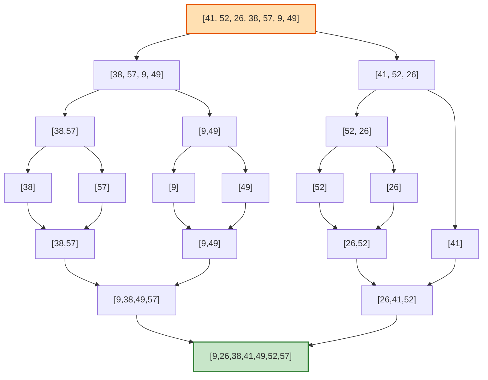

<!-- TOC -->

- [1. The Role of Algorithms in Computing](#1-the-role-of-algorithms-in-computing)
  - [1.1 Algorithms](#11-algorithms)
    - [1.1.2](#112)
    - [1.1.3](#113)
    - [1.1.4](#114)
    - [1.1.5](#115)
    - [1.1.6](#116)
  - [1.2 Algorithms as a technology](#12-algorithms-as-a-technology)
    - [1.2.1](#121)
    - [1.2.2](#122)
    - [1.2.3](#123)
  - [Problems](#problems)
    - [1.1 Comparison of running times](#11-comparison-of-running-times)
      - [1. $f(n)= log(n)$](#1-fn-logn)
      - [$sqrt(n)$](#sqrtn)
      - [$n$](#n)
      - [$nlog(n)$](#nlogn)
- [2. Getting Started](#2-getting-started)
  - [2.1 Insertion Sort](#21-insertion-sort)
    - [2.1.1](#211)
    - [2.1.2](#212)
    - [2.1.3](#213)
    - [2.1.4](#214)
  - [2.2 Analyzing algorithms](#22-analyzing-algorithms)
    - [2.2.1](#221)
    - [2.2.2](#222)
    - [2.2.3](#223)
    - [2.2.4](#224)
  - [2.3 Designing algorithms](#23-designing-algorithms)
    - [2.3.1](#231)
    - [2.3.2](#232)
    - [2.3.3](#233)
    - [2.3.4](#234)
    - [2.3.5](#235)
    - [2.3.6](#236)
    - [2.3.7](#237)
- [3. Growth of Functions](#3-growth-of-functions)
  - [3.1 Asymptotic notation](#31-asymptotic-notation)
    - [3.1.1](#311)
    - [3.1.2](#312)
    - [3.1.3](#313)
    - [3.1.4](#314)
    - [3.1.5](#315)
    - [3.1.6](#316)
    - [3.1.7](#317)
    - [3.1.8](#318)
- [4. Recurrences](#4-recurrences)
  - [4.1 The substitution method](#41-the-substitution-method)
    - [4.1.1](#411)
    - [4.1.2](#412)
    - [4.1.3](#413)
    - [4.1.4](#414)
    - [4.1.5](#415)
    - [4.1.6](#416)

<!-- /TOC -->
Trier par ordre de prix des objets a vendre sur Leboncoin

Describe one that requires finding the shortest distance between two points.

Trouver le meilleur chemin pour ce déplacer en voiture

---

# 1. The Role of Algorithms in Computing

## 1.1 Algorithms

### 1.1.2

Other than speed, what other measures of effciency might you need to consider in a real-world setting?

La consomation d'essences, l'état de la route

---

### 1.1.3

Select a data structure that you have seen, and discuss its strengths and limitations.

---

### 1.1.4

How are the shortest-path and traveling-salesperson problems given above similar?

The travelling salesman problem asks the following question: "Given a list of cities and the distances between each pair of cities, what is the shortest possible route that visits each city exactly once and returns to the origin city?

Dans les deux cas on doit trouver le chemin le plus rapide

How are they different?

Ils sont differents puisque la solution a chaque probléme n'est pas forcement la même, la solution du voyageur de commerce n'est pas forcement le chemin le plus court

---

### 1.1.5

Suggest a real-world problem in which only the best solution will do. 

Calculer le dosage exact d'un médicament en fonction du poids du patient pour éviter un surdosage ou un sous-dosage.

Then come up with one in which "approximately" the best solution is good enough.

Trouver une place de parking dans une ville : on ne cherche pas forcément la meilleure place possible, juste une qui soit suffisamment proche

---

### 1.1.6

Describe a real-world problem in which sometimes the entire input is available before you need to solve the problem, but other times the input is not entirely available in advance and arrives over time.

Entrée disponible en avance : Planifier un emploi du temps scolaire avant la rentrée, car toutes les matières, les salles et les professeurs sont connus.
Entrée qui arrive au fil du temps : Gérer les commandes d’un service de livraison en temps réel, car de nouvelles commandes arrivent constamment

---

## 1.2 Algorithms as a technology

### 1.2.1

Give an example of an application that requires algorithmic content at the application level, and discuss the function of the algorithms involved.

Un exemple d'application nécessitant un traitement algorithmique est la planification optimale des zones de pêche pour maximiser la capture tout en minimisant la consommation de carburant.

Rôle des algorithmes :

    Algorithmes d'optimisation de trajet (Dijkstra, A)* : Trouver le chemin le plus court entre le port et les zones de pêche tout en minimisant la consommation de carburant.

    Algorithmes de prédiction (réseaux neuronaux, arbres de décision) : Analyser les données environnementales (température de l'eau, courants, données satellites) pour prédire les zones les plus riches en poissons.

    Algorithmes d'allocation de ressources (Branch and Bound, programmation linéaire) : Gérer la répartition des navires sur les différentes zones de pêche.

---

### 1.2.2

Suppose that for inputs of size n on a particular computer, insertion sort runs in $8n^2$ steps and merge sort runs in $64nlog(n)$ steps. For which values of n does insertion sort beat merge sort?

On cherche n pour que:

$8n^2 < 64nlog(n)$
<br>
$n < 8log(n)$
<br>
En résolvant numériquement avec ce programme python:

```python
import math
n=1
while True:
    n+=1
    calcul=8*math.log(n,2)
    if n >=calcul:
        print(n)
        print(calcul)
        break

```

Je trouve n = 44

---

### 1.2.3

What is the smallest value of n such that an algorithm whose running time is $100n^2$ runs faster than an algorithm whose running time is $2^n$ on the same machine?

On cherche le plus petit n pour lequel :$100n^2<2^n$

On peut résoudre le problème en python:

```python

n=1
while True:
    n+=1
    calcul1=100*n**2
    calcul2=2**n
    if calcul1 < calcul2:
        print(n)
        print(calcul1,calcul2)
        break

```

Je trouve n=15

---

## Problems

### 1.1 Comparison of running times

For each function f(n) and time t in the following table, determine the largest
size n of a problem that can be solved in time t , assuming that the algorithm to
solve the problem takes f(n) microseconds.

|           | 1 second | 1 minute | 1 hour   | 1 month  | 1 year   | 1 century|
| ----------| ---------|--------  |--------  |--------  |--------  |--------  |
| log(n)    |          |          |          |          |          |          | 
| $sqrt(n)$ |          |          |          |          |          |          |
| $n$       |          |          |          |          |          |          |
| $nlog(n)$ |          |          |          |          |          |          |
| $n^2$     |          |          |          |          |          |          |
| $n^3$     |          |          |          |          |          |          |
| $2^n$     |          |          |          |          |          |          |
| $n!$      |          |          |          |          |          |          |

---

#### 1. $f(n)= log(n)$

On cherche n pour lequel: $log(n) \le T$ , avec T en microseconds et log en base 2

$n \le 2^T$

On résout pour chaque cas du tableau:

---

#### $sqrt(n)$

On cherche n pour lequel: $sqrt(n) \le T$ , avec T en microseconds et log en base 2

$n \le T^2$

On résout pour chaque cas du tableau:

---

#### $n$

On cherche n pour lequel: $n \le T$ , avec T en microseconds et log en base 2

$n \le T$

On résout pour chaque cas du tableau:

---

#### $nlog(n)$

On cherche n pour lequel: $nlog(n) \le T$ , avec T en microseconds et log en base 2

On résout pour chaque cas du tableau:

# 2. Getting Started

## 2.1 Insertion Sort

### 2.1.1

Using Figure 2.2 as a model, illustrate the operation of INSERTION-SORT on an array initially containing the sequence (31; 41; 59; 26; 41; 58).

|1     |2     |3     |4     |5     |6     |
|-     |-     |-     |-     |-     |-     |
|**31**|**31**|**31**|**26**|**26**|**26**|
|*41*  |**41**|**41**|**31**|**31**|**31**|
|59    |*59*  |**59**|**41**|**41**|**41**|
|26    |26    |*26*  |**59**|**41**|**41**|
|41    |41    |41    |*41*  |**59**|**58**|
|58    |58    |58    |58    |*58*  |**59**|

---

### 2.1.2

Consider the procedure SUM-ARRAY on the facing page. It computes the sum of the n numbers in array A[1:n]. State a loop invariant for this procedure, and use its initialization, maintenance, and termination properties to show that the SUM-ARRAY procedure returns the sum of the numbers in A[1:n].

```python

def sum_array(A,n)
    sum=0
    for i=1 to n:
        sum=sum+A[i]
    return sum

```

**Initialisation**
Avant la première itération (i = 1), sum = 0.
Or, la somme des éléments d’un sous-tableau vide est bien 0, donc l’invariant est vrai au début.

**Maintien**
Supposons que l’invariant est vrai au début de l’itération i, c’est-à-dire que sum contient la somme des éléments de A[1:i-1].
Lors de l’itération i, on ajoute A[i] :

sum = sum + A[i]

Après cette mise à jour, sum contient la somme des éléments de A[1:i], donc l’invariant est maintenu.

**Terminaison**
La boucle s’arrête quand i = n+1.
À ce moment-là, selon l’invariant, sum contient la somme des éléments de A[1:n], ce qui est exactement le résultat attendu. L’algorithme est donc correct.

---

### 2.1.3

Rewrite the INSERTION-SORT procedure to sort into monotonically decreasing instead of monotonically increasing order.

```python

def insertion_sort_increasing(A,n):

    for i in range(1,n):
        key=A[i]
        j=i-1
        while j>0 and A[j]>key:
            A[j+1]=A[j]
            j=j-1
        A[j+1]=key
    return A

```

```python

def insertion_sort_decreasing(A,n):

    for i in range(1,n):
        key=A[i]
        j=i-1
        while j>0 and A[j]<key:
            A[j+1]=A[j]
            j=j-1
        A[j+1]=key
    return A

```

---

### 2.1.4

Consider the searching problem:
Input: A sequence of n numbers $(a_1,a_1,...,a_n)$ i stored in array A[1:n] and a value x .

Output: An index i such that x equals A[i] or the special value NUL if x does not appear in A.

Write pseudocode for linear search, which scans through the array from beginning to end, looking for x . Using a loop invariant, prove that your algorithm is correct. Make sure that your loop invariant fulfills the three necessary properties.

```python

def linear_search(A,n,x):
    for i in range(n):
        if A[i]==x:
            return i
    return None

```

**Initialisation**
Avant chaque itération du for, x n’apparaît pas dans les indices 0 à i-1.

Cela signifie que si x existe, il est soit dans A[i:n], soit absent du tableau.

**Maintien**
Supposons que l’invariant est vrai avant une itération donnée (i).
Si A[i] == x, l’algorithme retourne i, ce qui est correct.

Sinon, x ne se trouve toujours pas dans A[0:i], et l’algorithme continue à chercher dans A[i+1:n], préservant ainsi l’invariant.

L’invariant est donc maintenu à chaque itération.

**Terminaison**
Le for se termine lorsque i = n.

Si x a été trouvé à un certain i, nous avons déjà retourné l’indice correct.

Si x n’a jamais été trouvé, l’invariant nous assure qu’il n’existe pas dans A, et nous retournons None.

Cela prouve que l’algorithme est correct.

---

## 2.2 Analyzing algorithms

### 2.2.1

Express the function $\frac{n^3}{1000} + 100n^2 -100n + 3$ in terms of‚ $\Theta$ notation.

$\Theta(n^3)$

---

### 2.2.2

Consider sorting n numbers stored in array A[1:n] by first finding the smallest element of A[1:n] and exchanging it with the element in A[1]. Then find the smallest element of A[2:n], and exchange it with A[2]. Then find the smallest element of A[3:n], and exchange it with A[3]. Continue in this manner for the first n-1 elements of A. Write pseudocode for this algorithm, which is known as selection sort. What loop invariant does this algorithm maintain? Why  does it need to run for only the first n - 1 elements, rather than for all n elements? Give the worst-case running time of selection sort in ‚$\Theta$ notation. Is the best-case running
time any better?

```python

def selection_sort(A,n):
    for i in range(n-1):                        
        min_index=i
        for j in range(i+1,n):
            if A[j] < A[min_index]:
                min_index = j
        A[i], A[min_index] = A[min_index], A[i]
    return A

A=[5,2,4,6,1,3]
n=len(A)
A=selection_sort(A,n)
print(A)
```

---

### 2.2.3

Consider linear search again (see Exercise 2.1-4). How many elements of the input array need to be checked on the average, assuming that the element being searched for is equally likely to be any element in the array? How about in the worst case? Using ‚$\Theta$ notation, give the average-case and worst-case running times of linear search. Justify your answers.

```python

def linear_search(A,n,x):
    for i in range(n):
        if A[i]==x:
            return i
    return None

```

En moyenne on doit checker environ $\Theta(n) elements$

---

### 2.2.4

How can you modify any sorting algorithm to have a good best-case running time?

Détecter si l'entrée est déjà triée avant de faire un tri complet

## 2.3 Designing algorithms

### 2.3.1

Using Figure 2.4 as a model, illustrate the operation of merge sort on an array initially containing the sequence {41; 52; 26; 38; 57; 9; 49}

```python

def merge(arr, left, mid, right):
    n1 = mid - left + 1  #length of arr[left,mid]
    n2 = right - mid  #lenght of arr[mid+1,right]

    # Create temp arrays
    L = [0] * n1
    R = [0] * n2

    # Copy data to temp arrays L[] and R[]
    for i in range(n1):
        L[i] = arr[left + i]
    for j in range(n2):
        R[j] = arr[mid + 1 + j]

    i = 0  # Initial index of first subarray
    j = 0  # Initial index of second subarray
    k = left  # Initial index of merged subarray

    # Merge the temp arrays back
    # into arr[left..right]
    while i < n1 and j < n2:
        if L[i] <= R[j]:
            arr[k] = L[i]
            i += 1
        else:
            arr[k] = R[j]
            j += 1
        k += 1

    # Copy the remaining elements of L[],
    # if there are any
    while i < n1:
        arr[k] = L[i]
        i += 1
        k += 1

    # Copy the remaining elements of R[], 
    # if there are any
    while j < n2:
        arr[k] = R[j]
        j += 1
        k += 1

def merge_sort(arr, left, right):
    if left < right:
        mid = (left + right) // 2

        merge_sort(arr, left, mid)
        merge_sort(arr, mid + 1, right)
        merge(arr, left, mid, right)

```

$$array=[41, 52, 26, 38, 57, 9, 49]$$



### 2.3.2

Rewrite the **MERGE** procedure so that it does not use sentinels, instead stopping when either array **L** or **R** has had all its elements copied back to **A** and then copying the remainder of the other array back into **A**.

```python

def merge(arr, left, mid, right):
    n1 = mid - left + 1  #length of arr[left,mid]
    n2 = right - mid  #lenght of arr[mid+1,right]

    # Create temp arrays
    L = [0] * n1
    R = [0] * n2

    # Copy data to temp arrays L[] and R[]
    for i in range(n1):
        L[i] = arr[left + i]
    for j in range(n2):
        R[j] = arr[mid + 1 + j]

    i = 0  # Initial index of first subarray
    j = 0  # Initial index of second subarray
    k = left  # Initial index of merged subarray

    # Merge the temp arrays back
    # into arr[left..right]
    while i < n1 and j < n2:
        if L[i] <= R[j]:
            arr[k] = L[i]
            i += 1
        else:
            arr[k] = R[j]
            j += 1
        k += 1

    # Copy the remaining elements of L[],
    # if there are any
    while i < n1:
        arr[k] = L[i]
        i += 1
        k += 1

    # Copy the remaining elements of R[], 
    # if there are any
    while j < n2:
        arr[k] = R[j]
        j += 1
        k += 1
```

---

### 2.3.3

Use mathematical induction to show that when **n** is an exact power of 2, the solution of the recurrence  

$$
T(n) = 
\begin{cases}
2 & \text{si } n = 2, \\\\
2T(n/2) + n & \text{si } n = 2^k, \text{ pour } k > 1
\end{cases}
$$
 
is $T(n) = n \log_2 n$

---

**On sait que**:

La fonction de récurrence est :

$$
T(n) =
\begin{cases}
2 & \text{si } n = 2, \\\\
2T(n/2) + n & \text{si } n = 2^k,\; k > 1
\end{cases}
$$

---

**On cherche à montrer que**:

Pour tout entier $k \geq 1$, si $n = 2^k$, alors :

$$
T(n) = n \log_2 n
$$

---

**Initialisation (cas de base)**:

Pour $n = 2$ :

- D'après la définition :  
  $T(2) = 2$
- Or :  
  $2 \log_2 2 = 2 \times 1 = 2$

✅ Donc la propriété est vraie au rang initial $n = 2$

---

**Hérédité**:

- Hypothèse de récurrence :

On suppose que pour un certain $k \geq 1$, on a :

$$
T(2^k) = 2^k \cdot \log_2(2^k) = 2^k \cdot k
$$

- On cherche maintenant a montrer :

$$
T(2^{k+1}) = 2^{k+1} \cdot (k+1)
$$

---

**Calcul**:

$$
T(2^{k+1}) = 2T(2^k) + 2^{k+1}
$$

On suppose que:

$$
T(2^k) = 2^k \cdot k
$$

Donc on remplace dans l’équation :

$$
T(2^{k+1}) = 2 \cdot (2^k \cdot k) + 2^{k+1}
= 2^{k+1} \cdot k + 2^{k+1}
= 2^{k+1}(k + 1)
$$

Et :

$$
2^{k+1} \log_2(2^{k+1}) = 2^{k+1} \cdot (k + 1)
$$

✅ Ce qui confirme la propriété au rang $k+1$

---

**Par conséquent**:

Par **récurrence**, on a bien :

$$
T(n) = n \log_2 n \quad \text{pour tout } n = 2^k,\; k \in \mathbb{N},\; k \geq 1
$$

---

### 2.3.4

Insertion sort can be expressed as a recursive procedure as follows. In order to sort $A[1 .. n]$, we recursively sort $A[1 .. n − 1]$ and then insert $A[n]$ into the sorted array $A[1 .. n − 1]$. Write a recurrence for the running time of this recursive version of insertion sort.

**On cherche que**:

On veut établir une **formule de récurrence** pour le **temps d'exécution** de cette version récursive de Insertion Sort, en notant $T(n)$ le temps nécessaire pour trier un tableau de taille $n$.

---

**On sait que**:

- Pour **insérer** un élément $A[n]$ dans un tableau trié de taille $n-1$, il faut au **pire** comparer $A[n]$ avec tous les $n-1$ éléments → cela coûte $\Theta(n)$.
- Le **temps pour trier** $A[1 \dots n-1]$ récursivement est noté $T(n-1)$.

Donc, on peut écrire la récurrence suivante :

$$
T(n) = T(n - 1) + \Theta(n)
$$

Et pour le cas de base :
$$
T(1) = \Theta(1)
$$
(car un tableau d’un seul élément est déjà trié)

---

**Par conséquent**:

La **formule de récurrence** du temps d'exécution pour Insertion Sort récursif est :

$$
T(n) =
\begin{cases}
\Theta(1) & \text{si } n = 1 \\
T(n - 1) + \Theta(n) & \text{si } n > 1
\end{cases}
$$

Et cette récurrence est **équivalente** à :
$$
T(n) = \Theta(n^2)
$$
(car on additionne une série arithmétique $1 + 2 + \dots + n$)

---

### 2.3.5

Referring back to the searching problem (see Exercise 2.1-3), observe that if the sequence **A** is sorted, we can check the midpoint of the sequence against a query value and eliminate half of the sequence from further consideration.  
**Binary search** is an algorithm that repeats this procedure, halving the size of the remaining portion of the sequence each time. Write pseudocode, either iterative or recursive, for binary search.  
Argue that the worst-case running time of binary search is **Θ(lg n)**.

---

### 2.3.6

Observe that the while loop of lines 5–7 of the **INSERTION-SORT** procedure in Section 2.1 uses a linear search to scan (backward) through the sorted subarray **A[1 .. j − 1]**.  
Can we use a binary search (see Exercise 2.3-5) instead to improve the overall worst-case running time of insertion sort to **Θ(n lg n)**?

---

### 2.3.7

Describe a **Θ(n lg n)**-time algorithm that, given a set **S** of **n** integers and another integer **x**, determines whether or not there exist two elements in **S** whose sum is exactly **x**.

---

# 3. Growth of Functions

## 3.1 Asymptotic notation

### 3.1.1

Let $f(n)$ and $g(n)$ be asymptotically nonnegative functions. Using the basic definition of $\Theta$-notation, prove that

$$
\max(f(n), g(n)) = \Theta(f(n) + g(n)).
$$

---

**On cherche a**:

Déterminer si la fonction $\max(f(n), g(n))$ appartient à $\Theta(f(n) + g(n))$, c’est-à-dire s’il existe des constantes positives $c_1, c_2$ et un entier $n_0$ tels que :

$$
0 \le c_1(f(n) + g(n)) \le \max(f(n), g(n)) \le c_2(f(n) + g(n)) \quad \text{pour tout } n \ge n_0.
$$

---

**On sait que**:

Puisque $f(n) \ge 0$ et $g(n) \ge 0$ asymptotiquement :

1. Par définition du maximum :
   $$
   \max(f(n), g(n)) \le f(n) + g(n)
   $$

2. En même temps, l’un des deux termes $f(n)$ ou $g(n)$ est égal à $\max(f(n), g(n))$, et l’autre est au plus égal à lui, donc :
   $$
   f(n) + g(n) \le 2 \cdot \max(f(n), g(n))
   $$

---

**Par conséquent**:

Nous obtenons l'encadrement suivant :
$$
\max(f(n), g(n)) \le f(n) + g(n) \le 2 \cdot \max(f(n), g(n))
$$

Cela implique :
$$
\frac{1}{2}(f(n) + g(n)) \le \max(f(n), g(n)) \le (f(n) + g(n))
$$

Donc, pour $c_1 = \frac{1}{2}$, $c_2 = 1$, et un certain $n_0$, on a bien :

$$
c_1(f(n) + g(n)) \le \max(f(n), g(n)) \le c_2(f(n) + g(n))
$$

---

**Conclusion** :

$$
\boxed{\max(f(n), g(n)) = \Theta(f(n) + g(n))}
$$

---

### 3.1.2

Show that for any real constants $a$ and $b$, where $b > 0$,
$$
(n + a)^b = \Theta(n^b).
$$

---

**On cherche à** :

Déterminer si la fonction $(n + a)^b$ appartient à $\Theta(n^b)$, c’est-à-dire s’il existe des constantes positives $c_1, c_2$ et un entier $n_0$ tels que :

$$
0 \le c_1 n^b \le (n + a)^b \le c_2 n^b \quad \text{pour tout } n \ge n_0.
$$

---

**On sait que** :

Pour $n$ suffisamment grand, $n + a \sim n$, donc les puissances restent proches.

- **Minoration** :
  $$
  n + a \ge \frac{n}{2} \quad \text{pour } n \ge 2|a| \Rightarrow (n + a)^b \ge \left(\frac{n}{2}\right)^b = \frac{1}{2^b}n^b
  $$

- **Majoration** :
  $$
  n + a \le 2n \quad \text{pour } n \ge 2|a| \Rightarrow (n + a)^b \le (2n)^b = 2^b n^b
  $$

---

**Par conséquent** :

On a pour $n \ge 2|a|$ :

$$
\frac{1}{2^b}n^b \le (n + a)^b \le 2^b n^b
$$

Donc, avec $c_1 = \frac{1}{2^b}$, $c_2 = 2^b$, et $n_0 = 2|a|$, on a bien :

$$
c_1 n^b \le (n + a)^b \le c_2 n^b
$$

---

**Conclusion** :

$$
\boxed{(n + a)^b = \Theta(n^b)}
$$

### 3.1.3

Explain why the statement, “The running time of algorithm $A$ is at least $O(n^2)$,” is meaningless.

### 3.1.4

Is $2^{n+1} = O(2^n)$? Is $2^{2n} = O(2^n)$?

### 3.1.5

Prove Theorem 3.1.

### 3.1.6

Prove that the running time of an algorithm is $\Theta(g(n))$ if and only if its worst-case running time is $O(g(n))$ and its best-case running time is $\Omega(g(n))$.

### 3.1.7

Prove that $o(g(n)) \cap \omega(g(n))$ is the empty set.

### 3.1.8

We can extend our notation to the case of two parameters $n$ and $m$ that can go to infinity independently at different rates. For a given function $g(n, m)$, we denote by $O(g(n, m))$ the set of functions
$$
O(g(n, m)) = \{ f(n, m) : \text{there exist positive constants } c, n_0, m_0 \text{ such that } 0 \le f(n, m) \le c g(n, m) \text{ for all } n \ge n_0 \text{ and } m \ge m_0 \}.
$$
Give corresponding definitions for $\Omega(g(n, m))$ and $\Theta(g(n, m))$.

# 4. Recurrences

## 4.1 The substitution method

### 4.1.1

Show that the solution of $T(n) = T(\lfloor n/2 \rfloor) + 1$ is $O(\log n)$.

**On cherche :**

Montrer que $T(n) = O(\log n)$, c’est-à-dire qu’il existe des constantes $c > 0$ et $n_0$ telles que pour tout $n \geq n_0$, on ait :

$$T(n) \leq c \log n$$

---

**On sait que** :

La récurrence est :  
$$
T(n) = T(\lfloor n/2 \rfloor) + 1
$$

On fait l'hypothèse de récurrence suivante pour la méthode de substitution :  
$$
T(k) \leq c \log k \quad \text{pour tout } k < n
$$

Alors on a :  
$$
T(n) = T(\lfloor n/2 \rfloor) + 1 \leq c \log(\lfloor n/2 \rfloor) + 1
$$

Comme $\lfloor n/2 \rfloor \leq n/2$, on a :  
$$
\log(\lfloor n/2 \rfloor) \leq \log(n/2) = \log n - \log 2
$$

Donc :  
$$
T(n) \leq c (\log n - \log 2) + 1 = c \log n - c \log 2 + 1
$$

---

**Par conséquent** :  
$$
T(n) \leq c \log n - c \log 2 + 1
$$

Si on choisit $c$ assez grand pour que $-c \log 2 + 1 \leq 0$, par exemple $c \geq \frac{1}{\log 2}$, alors :  
$$
T(n) \leq c \log n
$$

---

**Conclusion** :  
La solution est bien $T(n) = O(\log n)$.

### 4.1.2

We saw that the solution of $T(n) = 2T(\lfloor n/2 \rfloor) + n$ is $O(n \log n)$. Show that the solution of this recurrence is also $\Omega(n \log n)$. Conclude that the solution is $\Theta(n \log n)$.

### 4.1.3

Show that by making a different inductive hypothesis, we can overcome the difficulty with the boundary condition $T(1) = 1$ for the recurrence (4.4) without adjusting the boundary conditions for the inductive proof.

### 4.1.4

Show that $\Theta(n \log n)$ is the solution to the "exact" recurrence (4.2) for merge sort.

### 4.1.5

Show that the solution to $T(n) = 2T(\lfloor n/2 \rfloor + 17) + n$ is $O(n \log n)$.

### 4.1.6

Solve the recurrence $T(n) = 2T(\sqrt{n}) + 1$ by making a change of variables. Your solution should be asymptotically tight. Do not worry about whether values are integral.
