<!-- TOC -->

- [2. Getting Started](#2-getting-started)
  - [2.1 Insertion Sort](#21-insertion-sort)
    - [2.1.1](#211)
    - [2.1.2](#212)
    - [2.1.3](#213)
    - [2.1.4](#214)
  - [2.2 Analyzing algorithms](#22-analyzing-algorithms)
    - [2.2.1](#221)
    - [2.2.2](#222)
    - [2.2.3](#223)
    - [2.2.4](#224)
  - [2.3 Designing algorithms](#23-designing-algorithms)
    - [2.3.1](#231)
    - [2.3.2](#232)
    - [2.3.3](#233)
    - [2.3.4](#234)
    - [2.3.5](#235)
    - [2.3.6](#236)
    - [2.3.7](#237)
- [3. Growth of Functions](#3-growth-of-functions)
  - [3.1 Asymptotic notation](#31-asymptotic-notation)
    - [3.1.1](#311)
    - [3.1.2](#312)
    - [3.1.3](#313)
    - [3.1.4](#314)
    - [3.1.5](#315)
    - [3.1.6](#316)
    - [3.1.7](#317)
    - [3.1.8](#318)
- [4. Recurrences](#4-recurrences)
  - [4.1 The substitution method](#41-the-substitution-method)
    - [4.1.1](#411)
    - [4.1.2](#412)
    - [4.1.3](#413)
    - [4.1.4](#414)
    - [4.1.5](#415)
    - [4.1.6](#416)
  - [4.3 The master theorem](#43-the-master-theorem)
    - [Résumé : Master Theorem (Théorème Maître)](#résumé--master-theorem-théorème-maître)
    - [4.3.1](#431)
    - [4.3.2](#432)
    - [4.3.3](#433)
    - [4.3.4](#434)
    - [4.3.5](#435)
- [6. HeapSort](#6-heapsort)
  - [6.1 Heaps](#61-heaps)
    - [Résume de cour](#résume-de-cour)
    - [Exercices](#exercices)
    - [6.1.1](#611)
    - [6.1.2](#612)
    - [6.1.3](#613)
    - [6.1.4](#614)
    - [6.1.5](#615)
    - [6.1.6](#616)
    - [6.1.7](#617)
  - [6.2 Maintaining the heap property](#62-maintaining-the-heap-property)
    - [6.2.1 V](#621-v)
    - [6.2.2 V](#622-v)
    - [6.2.3 V](#623-v)
    - [6.2.4 V](#624-v)
    - [6.2.5 V](#625-v)
    - [6.2.6 N](#626-n)
  - [6.3 Building a heap](#63-building-a-heap)
    - [Résume de cour](#résume-de-cour-1)
    - [Exercices](#exercices-1)
      - [6.3.1 V](#631-v)
      - [6.3.2 V](#632-v)
      - [6.3.3 V](#633-v)
  - [6.4 The heapsort algorithm](#64-the-heapsort-algorithm)
    - [Résume de cour](#résume-de-cour-2)
    - [Exercices](#exercices-2)
      - [6.4.1 N](#641-n)
      - [6.4.2 N](#642-n)
      - [6.4.3 N](#643-n)
      - [6.4.4 N](#644-n)
  - [6.5 Priority queues](#65-priority-queues)
    - [Résumé de cour](#résumé-de-cour)
    - [Exercices](#exercices-3)
      - [6.5.1](#651)
      - [6.5.2](#652)
      - [6.5.3](#653)
      - [6.5.4](#654)
      - [6.5.5](#655)
      - [6.5.6](#656)
      - [6.5.7](#657)
      - [6.5.8](#658)
- [7. Quicksort](#7-quicksort)
  - [7.1 Description of quicksort](#71-description-of-quicksort)
    - [Résumer de cour](#résumer-de-cour)
    - [Exercises](#exercises)
      - [7.1.1 V](#711-v)
      - [7.1.2 V](#712-v)
      - [7.1.3](#713)
- [10. Elementary Data Structure](#10-elementary-data-structure)
  - [10.1 Stack and queues](#101-stack-and-queues)
  - [Résumer de cour](#résumer-de-cour-1)
- [15. Dynamic Programming](#15-dynamic-programming)
  - [15.1 Assembly-line scheduling](#151-assembly-line-scheduling)
    - [Resumer du cour](#resumer-du-cour)
    - [Exercises](#exercises-1)
      - [15.1‑1](#1511)
      - [15.1‑2](#1512)
      - [15.1‑3](#1513)
      - [15.1‑4](#1514)
      - [15.1‑5](#1515)

<!-- /TOC -->
      - [15.1‑2](#1512)
      - [15.1‑3](#1513)
      - [15.1‑4](#1514)
      - [15.1‑5](#1515)

<!-- /TOC -->
    - [Resumer du cour](#resumer-du-cour)

<!-- /TOC -->
  - [Résumer de cour](#résumer-de-cour-1)

<!-- /TOC -->
How are the shortest-path and traveling-salesperson problems given above similar?

The travelling salesman problem asks the following question: "Given a list of cities and the distances between each pair of cities, what is the shortest possible route that visits each city exactly once and returns to the origin city?

Dans les deux cas on doit trouver le chemin le plus rapide

How are they different?

Ils sont differents puisque la solution a chaque probléme n'est pas forcement la même, la solution du voyageur de commerce n'est pas forcement le chemin le plus court

---

### 1.1.5

Suggest a real-world problem in which only the best solution will do. 

Calculer le dosage exact d'un médicament en fonction du poids du patient pour éviter un surdosage ou un sous-dosage.

Then come up with one in which "approximately" the best solution is good enough.

Trouver une place de parking dans une ville : on ne cherche pas forcément la meilleure place possible, juste une qui soit suffisamment proche

---

### 1.1.6

Describe a real-world problem in which sometimes the entire input is available before you need to solve the problem, but other times the input is not entirely available in advance and arrives over time.

Entrée disponible en avance : Planifier un emploi du temps scolaire avant la rentrée, car toutes les matières, les salles et les professeurs sont connus.
Entrée qui arrive au fil du temps : Gérer les commandes d’un service de livraison en temps réel, car de nouvelles commandes arrivent constamment

---

## 1.2 Algorithms as a technology

### 1.2.1

Give an example of an application that requires algorithmic content at the application level, and discuss the function of the algorithms involved.

Un exemple d'application nécessitant un traitement algorithmique est la planification optimale des zones de pêche pour maximiser la capture tout en minimisant la consommation de carburant.

Rôle des algorithmes :

    Algorithmes d'optimisation de trajet (Dijkstra, A)* : Trouver le chemin le plus court entre le port et les zones de pêche tout en minimisant la consommation de carburant.

    Algorithmes de prédiction (réseaux neuronaux, arbres de décision) : Analyser les données environnementales (température de l'eau, courants, données satellites) pour prédire les zones les plus riches en poissons.

    Algorithmes d'allocation de ressources (Branch and Bound, programmation linéaire) : Gérer la répartition des navires sur les différentes zones de pêche.

---

### 1.2.2

Suppose that for inputs of size n on a particular computer, insertion sort runs in $8n^2$ steps and merge sort runs in $64nlog(n)$ steps. For which values of n does insertion sort beat merge sort?

On cherche n pour que:

$8n^2 < 64nlog(n)$
<br>
$n < 8log(n)$
<br>
En résolvant numériquement avec ce programme python:

```python
import math
n=1
while True:
    n+=1
    calcul=8*math.log(n,2)
    if n >=calcul:
        print(n)
        print(calcul)
        break

```

Je trouve n = 44

---

### 1.2.3

What is the smallest value of n such that an algorithm whose running time is $100n^2$ runs faster than an algorithm whose running time is $2^n$ on the same machine?

On cherche le plus petit n pour lequel :$100n^2<2^n$

On peut résoudre le problème en python:

```python

n=1
while True:
    n+=1
    calcul1=100*n**2
    calcul2=2**n
    if calcul1 < calcul2:
        print(n)
        print(calcul1,calcul2)
        break

```

Je trouve n=15

---

## Problems

### 1.1 Comparison of running times

For each function f(n) and time t in the following table, determine the largest
size n of a problem that can be solved in time t , assuming that the algorithm to
solve the problem takes f(n) microseconds.

|           | 1 second | 1 minute | 1 hour   | 1 month  | 1 year   | 1 century|
| ----------| ---------|--------  |--------  |--------  |--------  |--------  |
| log(n)    |          |          |          |          |          |          | 
| $sqrt(n)$ |          |          |          |          |          |          |
| $n$       |          |          |          |          |          |          |
| $nlog(n)$ |          |          |          |          |          |          |
| $n^2$     |          |          |          |          |          |          |
| $n^3$     |          |          |          |          |          |          |
| $2^n$     |          |          |          |          |          |          |
| $n!$      |          |          |          |          |          |          |

---

**$f(n)= log(n)$**:

On cherche n pour lequel: $log(n) \le T$ , avec T en microseconds et log en base 2

$n \le 2^T$

On résout pour chaque cas du tableau:

---

**$sqrt(n)$**:

On cherche n pour lequel: $sqrt(n) \le T$ , avec T en microseconds et log en base 2

$n \le T^2$

On résout pour chaque cas du tableau:

---

**$n$**

On cherche n pour lequel: $n \le T$ , avec T en microseconds et log en base 2

$n \le T$

On résout pour chaque cas du tableau:

---

**$nlog(n)$**

On cherche n pour lequel: $nlog(n) \le T$ , avec T en microseconds et log en base 2

On résout pour chaque cas du tableau:

# 2. Getting Started

## 2.1 Insertion Sort

### 2.1.1

Using Figure 2.2 as a model, illustrate the operation of INSERTION-SORT on an array initially containing the sequence (31; 41; 59; 26; 41; 58).

|1     |2     |3     |4     |5     |6     |
|-     |-     |-     |-     |-     |-     |
|**31**|**31**|**31**|**26**|**26**|**26**|
|*41*  |**41**|**41**|**31**|**31**|**31**|
|59    |*59*  |**59**|**41**|**41**|**41**|
|26    |26    |*26*  |**59**|**41**|**41**|
|41    |41    |41    |*41*  |**59**|**58**|
|58    |58    |58    |58    |*58*  |**59**|

---

### 2.1.2

Consider the procedure SUM-ARRAY on the facing page. It computes the sum of the n numbers in array A[1:n]. State a loop invariant for this procedure, and use its initialization, maintenance, and termination properties to show that the SUM-ARRAY procedure returns the sum of the numbers in A[1:n].

```python

def sum_array(A,n)
    sum=0
    for i=1 to n:
        sum=sum+A[i]
    return sum

```

**Initialisation**
Avant la première itération (i = 1), sum = 0.
Or, la somme des éléments d’un sous-tableau vide est bien 0, donc l’invariant est vrai au début.

**Maintien**
Supposons que l’invariant est vrai au début de l’itération i, c’est-à-dire que sum contient la somme des éléments de A[1:i-1].
Lors de l’itération i, on ajoute A[i] :

sum = sum + A[i]

Après cette mise à jour, sum contient la somme des éléments de A[1:i], donc l’invariant est maintenu.

**Terminaison**
La boucle s’arrête quand i = n+1.
À ce moment-là, selon l’invariant, sum contient la somme des éléments de A[1:n], ce qui est exactement le résultat attendu. L’algorithme est donc correct.

---

### 2.1.3

Rewrite the INSERTION-SORT procedure to sort into monotonically decreasing instead of monotonically increasing order.

```python

def insertion_sort_increasing(A,n):

    for i in range(1,n):
        key=A[i]
        j=i-1
        while j>0 and A[j]>key:
            A[j+1]=A[j]
            j=j-1
        A[j+1]=key
    return A

```

```python

def insertion_sort_decreasing(A,n):

    for i in range(1,n):
        key=A[i]
        j=i-1
        while j>0 and A[j]<key:
            A[j+1]=A[j]
            j=j-1
        A[j+1]=key
    return A

```

---

### 2.1.4

Consider the searching problem:
Input: A sequence of n numbers $(a_1,a_1,...,a_n)$ i stored in array A[1:n] and a value x .

Output: An index i such that x equals A[i] or the special value NUL if x does not appear in A.

Write pseudocode for linear search, which scans through the array from beginning to end, looking for x . Using a loop invariant, prove that your algorithm is correct. Make sure that your loop invariant fulfills the three necessary properties.

```python

def linear_search(A,n,x):
    for i in range(n):
        if A[i]==x:
            return i
    return None

```

**Initialisation**
Avant chaque itération du for, x n’apparaît pas dans les indices 0 à i-1.

Cela signifie que si x existe, il est soit dans A[i:n], soit absent du tableau.

**Maintien**
Supposons que l’invariant est vrai avant une itération donnée (i).
Si A[i] == x, l’algorithme retourne i, ce qui est correct.

Sinon, x ne se trouve toujours pas dans A[0:i], et l’algorithme continue à chercher dans A[i+1:n], préservant ainsi l’invariant.

L’invariant est donc maintenu à chaque itération.

**Terminaison**
Le for se termine lorsque i = n.

Si x a été trouvé à un certain i, nous avons déjà retourné l’indice correct.

Si x n’a jamais été trouvé, l’invariant nous assure qu’il n’existe pas dans A, et nous retournons None.

Cela prouve que l’algorithme est correct.

---

## 2.2 Analyzing algorithms

### 2.2.1

Express the function $\frac{n^3}{1000} + 100n^2 -100n + 3$ in terms of‚ $\Theta$ notation.

$\Theta(n^3)$

---

### 2.2.2

Consider sorting n numbers stored in array A[1:n] by first finding the smallest element of A[1:n] and exchanging it with the element in A[1]. Then find the smallest element of A[2:n], and exchange it with A[2]. Then find the smallest element of A[3:n], and exchange it with A[3]. Continue in this manner for the first n-1 elements of A. Write pseudocode for this algorithm, which is known as selection sort. What loop invariant does this algorithm maintain? Why  does it need to run for only the first n - 1 elements, rather than for all n elements? Give the worst-case running time of selection sort in ‚$\Theta$ notation. Is the best-case running
time any better?

```python

def selection_sort(A,n):
    for i in range(n-1):                        
        min_index=i
        for j in range(i+1,n):
            if A[j] < A[min_index]:
                min_index = j
        A[i], A[min_index] = A[min_index], A[i]
    return A

A=[5,2,4,6,1,3]
n=len(A)
A=selection_sort(A,n)
print(A)
```

---

### 2.2.3

Consider linear search again (see Exercise 2.1-4). How many elements of the input array need to be checked on the average, assuming that the element being searched for is equally likely to be any element in the array? How about in the worst case? Using ‚$\Theta$ notation, give the average-case and worst-case running times of linear search. Justify your answers.

```python

def linear_search(A,n,x):
    for i in range(n):
        if A[i]==x:
            return i
    return None

```

En moyenne on doit checker environ $\Theta(n) elements$

---

### 2.2.4

How can you modify any sorting algorithm to have a good best-case running time?

Détecter si l'entrée est déjà triée avant de faire un tri complet

## 2.3 Designing algorithms

### 2.3.1

Using Figure 2.4 as a model, illustrate the operation of merge sort on an array initially containing the sequence {41; 52; 26; 38; 57; 9; 49}

```python

def merge(arr, left, mid, right):
    n1 = mid - left + 1  #length of arr[left,mid]
    n2 = right - mid  #lenght of arr[mid+1,right]

    # Create temp arrays
    L = [0] * n1
    R = [0] * n2

    # Copy data to temp arrays L[] and R[]
    for i in range(n1):
        L[i] = arr[left + i]
    for j in range(n2):
        R[j] = arr[mid + 1 + j]

    i = 0  # Initial index of first subarray
    j = 0  # Initial index of second subarray
    k = left  # Initial index of merged subarray

    # Merge the temp arrays back
    # into arr[left..right]
    while i < n1 and j < n2:
        if L[i] <= R[j]:
            arr[k] = L[i]
            i += 1
        else:
            arr[k] = R[j]
            j += 1
        k += 1

    # Copy the remaining elements of L[],
    # if there are any
    while i < n1:
        arr[k] = L[i]
        i += 1
        k += 1

    # Copy the remaining elements of R[], 
    # if there are any
    while j < n2:
        arr[k] = R[j]
        j += 1
        k += 1

def merge_sort(arr, left, right):
    if left < right:
        mid = (left + right) // 2

        merge_sort(arr, left, mid)
        merge_sort(arr, mid + 1, right)
        merge(arr, left, mid, right)

```

$$array=[41, 52, 26, 38, 57, 9, 49]$$

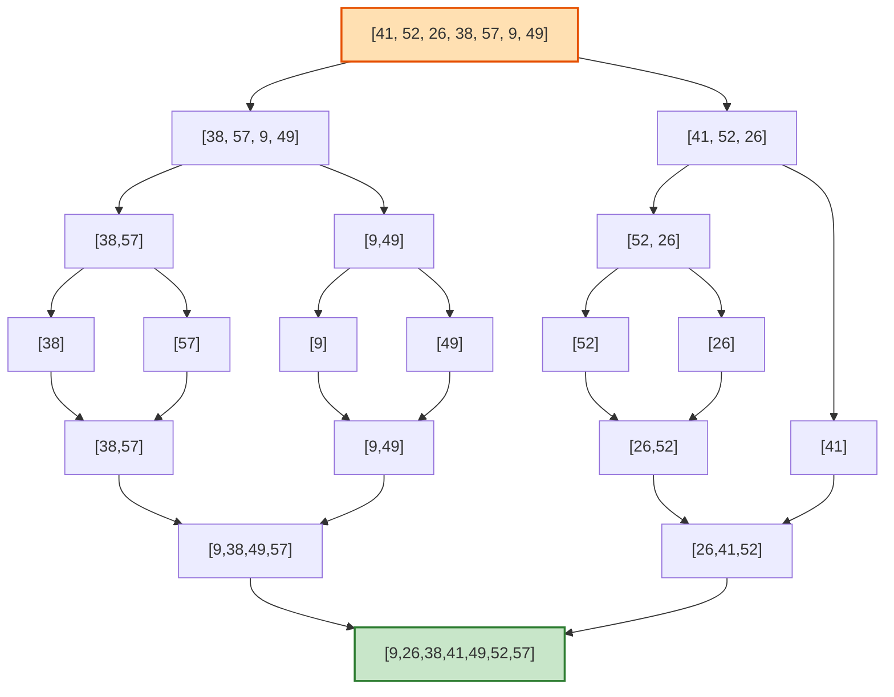
```mermaid
graph TD;
    style 1 fill:#ffe0b2,stroke:#e65100,stroke-width:2px
    style F fill:#c8e6c9,stroke:#2e7d32,stroke-width:2px
    1["[41, 52, 26, 38, 57, 9, 49]"] --> A2.1["[41, 52, 26]"]
    1 --> B2.2["[38, 57, 9, 49]"]
    
    A2.1 --> A3.1["[41]"]
    A2.1 --> A3.2["[52, 26]"]

    A3.2 --> A4.1["[52]"]
    A3.2 --> A4.2["[26]"]

    A4.1 --> A5.1["[26,52]"]
    A5.1 --> A6.1["[26,41,52]"]
    A4.2 --> A5.1
    A3.1 --> A6.1

    B2.2 --> B3.1["[38,57]"]
    B2.2 --> B3.2["[9,49]"]

    B3.1 --> B4.1["[38]"]
    B3.1 --> B4.2["[57]"]
    B3.2 --> B4.3["[9]"]
    B3.2 --> B4.4["[49]"]

    B4.1 --> B5.1["[38,57]"]
    B4.2 --> B5.1
    B4.3 --> B5.2["[9,49]"]
    B4.4 --> B5.2

    B5.1 --> B6.1["[9,38,49,57]"]
    B5.2 -->B6.1

    B6.1 --> F["[9,26,38,41,49,52,57]"]
    A6.1 --> F

```

### 2.3.2

Rewrite the **MERGE** procedure so that it does not use sentinels, instead stopping when either array **L** or **R** has had all its elements copied back to **A** and then copying the remainder of the other array back into **A**.

```python

def merge(arr, left, mid, right):
    n1 = mid - left + 1  #length of arr[left,mid]
    n2 = right - mid  #lenght of arr[mid+1,right]

    # Create temp arrays
    L = [0] * n1
    R = [0] * n2

    # Copy data to temp arrays L[] and R[]
    for i in range(n1):
        L[i] = arr[left + i]
    for j in range(n2):
        R[j] = arr[mid + 1 + j]

    i = 0  # Initial index of first subarray
    j = 0  # Initial index of second subarray
    k = left  # Initial index of merged subarray

    # Merge the temp arrays back
    # into arr[left..right]
    while i < n1 and j < n2:
        if L[i] <= R[j]:
            arr[k] = L[i]
            i += 1
        else:
            arr[k] = R[j]
            j += 1
        k += 1

    # Copy the remaining elements of L[],
    # if there are any
    while i < n1:
        arr[k] = L[i]
        i += 1
        k += 1

    # Copy the remaining elements of R[], 
    # if there are any
    while j < n2:
        arr[k] = R[j]
        j += 1
        k += 1
```

---

### 2.3.3

Use mathematical induction to show that when **n** is an exact power of 2, the solution of the recurrence  

$$
T(n) = 
\begin{cases}
2 & \text{si } n = 2, \\\\
2T(n/2) + n & \text{si } n = 2^k, \text{ pour } k > 1
\end{cases}
$$
 
is $T(n) = n \log_2 n$

---

**On cherche à montrer que**:

Pour tout entier $k \geq 1$, si $n = 2^k$, alors :

$$
T(n) = n \log_2 n
$$

---

**Initialisation (cas de base)**:

Pour $n = 2$ :

- D'après la définition :  
  $T(2) = 2$
- Or :  
  $2 \log_2 2 = 2 \times 1 = 2$

Donc la propriété est vraie au rang initial $n = 2$

---

**Hérédité**:

- Hypothèse de récurrence :

On suppose que pour un certain $k \geq 1$, on a :

$$
T(2^k) = 2^k \cdot \log_2(2^k) = 2^k \cdot k
$$

- On cherche maintenant a montrer :

$$
T(2^{k+1}) = 2^{k+1} \cdot (k+1)
$$

---

**Calcul**:

$$
T(2^{k+1}) = 2T(2^k) + 2^{k+1}
$$

On suppose que:

$$
T(2^k) = 2^k \cdot k
$$

Donc on remplace dans l’équation :

$$
T(2^{k+1}) = 2 \cdot (2^k \cdot k) + 2^{k+1}
= 2^{k+1} \cdot k + 2^{k+1}
= 2^{k+1}(k + 1)
$$

Et :

$$
2^{k+1} \log_2(2^{k+1}) = 2^{k+1} \cdot (k + 1)
$$

Ce qui confirme la propriété au rang $k+1$

---

**Par conséquent**:

Par **récurrence**, on a bien :

$$
T(n) = n \log_2 n \quad \text{pour tout } n = 2^k,\; k \in \mathbb{N},\; k \geq 1
$$

---

### 2.3.4

Insertion sort can be expressed as a recursive procedure as follows. In order to sort $A[1 .. n]$, we recursively sort $A[1 .. n − 1]$ and then insert $A[n]$ into the sorted array $A[1 .. n − 1]$. Write a recurrence for the running time of this recursive version of insertion sort.

**On cherche que**:

On veut établir une **formule de récurrence** pour le **temps d'exécution** de cette version récursive de Insertion Sort, en notant $T(n)$ le temps nécessaire pour trier un tableau de taille $n$.

---

**On sait que**:

- Pour **insérer** un élément $A[n]$ dans un tableau trié de taille $n-1$, il faut au **pire** comparer $A[n]$ avec tous les $n-1$ éléments → cela coûte $\Theta(n)$.
- Le **temps pour trier** $A[1 \dots n-1]$ récursivement est noté $T(n-1)$.

Donc, on peut écrire la récurrence suivante :

$$
T(n) = T(n - 1) + \Theta(n)
$$

Et pour le cas de base :
$$
T(1) = \Theta(1)
$$
(car un tableau d’un seul élément est déjà trié)

---

**Par conséquent**:

La **formule de récurrence** du temps d'exécution pour Insertion Sort récursif est :

$$
T(n) =
\begin{cases}
\Theta(1) & \text{si } n = 1 \\
T(n - 1) + \Theta(n) & \text{si } n > 1
\end{cases}
$$

Et cette récurrence est **équivalente** à :
$$
T(n) = \Theta(n^2)
$$
(car on additionne une série arithmétique $1 + 2 + \dots + n$)

---

### 2.3.5

Referring back to the searching problem (see Exercise 2.1-3), observe that if the sequence **A** is sorted, we can check the midpoint of the sequence against a query value and eliminate half of the sequence from further consideration.  
**Binary search** is an algorithm that repeats this procedure, halving the size of the remaining portion of the sequence each time. Write pseudocode, either iterative or recursive, for binary search.  
Argue that the worst-case running time of binary search is **Θ(lg n)**.

---

### 2.3.6

Observe that the while loop of lines 5–7 of the **INSERTION-SORT** procedure in Section 2.1 uses a linear search to scan (backward) through the sorted subarray **A[1 .. j − 1]**.  
Can we use a binary search (see Exercise 2.3-5) instead to improve the overall worst-case running time of insertion sort to **Θ(n lg n)**?

---

### 2.3.7

Describe a **Θ(n lg n)**-time algorithm that, given a set **S** of **n** integers and another integer **x**, determines whether or not there exist two elements in **S** whose sum is exactly **x**.

---

# 3. Growth of Functions

## 3.1 Asymptotic notation

### 3.1.1

Let $f(n)$ and $g(n)$ be asymptotically nonnegative functions. Using the basic definition of $\Theta$-notation, prove that

$$
\max(f(n), g(n)) = \Theta(f(n) + g(n)).
$$

---

**On cherche a**:

Déterminer si la fonction $\max(f(n), g(n))$ appartient à $\Theta(f(n) + g(n))$, c’est-à-dire s’il existe des constantes positives $c_1, c_2$ et un entier $n_0$ tels que :

$$
0 \le c_1(f(n) + g(n)) \le \max(f(n), g(n)) \le c_2(f(n) + g(n)) \quad \text{pour tout } n \ge n_0.
$$

---

**On sait que**:

Puisque $f(n) \ge 0$ et $g(n) \ge 0$ asymptotiquement :

1. Par définition du maximum :
   $$
   \max(f(n), g(n)) \le f(n) + g(n)
   $$

2. En même temps, l’un des deux termes $f(n)$ ou $g(n)$ est égal à $\max(f(n), g(n))$, et l’autre est au plus égal à lui, donc :
   $$
   f(n) + g(n) \le 2 \cdot \max(f(n), g(n))
   $$

---

**Par conséquent**:

Nous obtenons l'encadrement suivant :
$$
\max(f(n), g(n)) \le f(n) + g(n) \le 2 \cdot \max(f(n), g(n))
$$

Cela implique :
$$
\frac{1}{2}(f(n) + g(n)) \le \max(f(n), g(n)) \le (f(n) + g(n))
$$

Donc, pour $c_1 = \frac{1}{2}$, $c_2 = 1$, et un certain $n_0$, on a bien :

$$
c_1(f(n) + g(n)) \le \max(f(n), g(n)) \le c_2(f(n) + g(n))
$$

---

**Conclusion** :

$$
\boxed{\max(f(n), g(n)) = \Theta(f(n) + g(n))}
$$

---

### 3.1.2

Show that for any real constants $a$ and $b$, where $b > 0$,
$$
(n + a)^b = \Theta(n^b).
$$

---

**On cherche à** :

Déterminer si la fonction $(n + a)^b$ appartient à $\Theta(n^b)$, c’est-à-dire s’il existe des constantes positives $c_1, c_2$ et un entier $n_0$ tels que :

$$
0 \le c_1 n^b \le (n + a)^b \le c_2 n^b \quad \text{pour tout } n \ge n_0.
$$

---

**On sait que** :

Pour $n$ suffisamment grand, $n + a \sim n$, donc les puissances restent proches.

- **Minoration** :
  $$
  n + a \ge \frac{n}{2} \quad \text{pour } n \ge 2|a| \Rightarrow (n + a)^b \ge \left(\frac{n}{2}\right)^b = \frac{1}{2^b}n^b
  $$

- **Majoration** :
  $$
  n + a \le 2n \quad \text{pour } n \ge 2|a| \Rightarrow (n + a)^b \le (2n)^b = 2^b n^b
  $$

---

**Par conséquent** :

On a pour $n \ge 2|a|$ :

$$
\frac{1}{2^b}n^b \le (n + a)^b \le 2^b n^b
$$

Donc, avec $c_1 = \frac{1}{2^b}$, $c_2 = 2^b$, et $n_0 = 2|a|$, on a bien :

$$
c_1 n^b \le (n + a)^b \le c_2 n^b
$$

---

**Conclusion** :

$$
\boxed{(n + a)^b = \Theta(n^b)}
$$

### 3.1.3

Explain why the statement, “The running time of algorithm $A$ is at least $O(n^2)$,” is meaningless.

### 3.1.4

Is $2^{n+1} = O(2^n)$? Is $2^{2n} = O(2^n)$?

### 3.1.5

Prove Theorem 3.1.

### 3.1.6

Prove that the running time of an algorithm is $\Theta(g(n))$ if and only if its worst-case running time is $O(g(n))$ and its best-case running time is $\Omega(g(n))$.

### 3.1.7

Prove that $o(g(n)) \cap \omega(g(n))$ is the empty set.

### 3.1.8

We can extend our notation to the case of two parameters $n$ and $m$ that can go to infinity independently at different rates. For a given function $g(n, m)$, we denote by $O(g(n, m))$ the set of functions
$$
O(g(n, m)) = \{ f(n, m) : \text{there exist positive constants } c, n_0, m_0 \text{ such that } 0 \le f(n, m) \le c g(n, m) \text{ for all } n \ge n_0 \text{ and } m \ge m_0 \}.
$$
Give corresponding definitions for $\Omega(g(n, m))$ and $\Theta(g(n, m))$.

# 4. Recurrences

## 4.1 The substitution method

### 4.1.1

Show that the solution of $T(n) = T(\lfloor n/2 \rfloor) + 1$ is $O(\log n)$.

**On cherche :**

Montrer que $T(n) = O(\log n)$, c’est-à-dire qu’il existe des constantes $c > 0$ et $n_0$ telles que pour tout $n \geq n_0$, on ait :

$$T(n) \leq c \log n$$

---

**On sait que** :

La récurrence est :  
$$
T(n) = T(\lfloor n/2 \rfloor) + 1
$$

On fait l'hypothèse de récurrence suivante pour la méthode de substitution :  
$$
T(k) \leq c \log k \quad \text{pour tout } k < n
$$

Alors on a :  
$$
T(n) = T(\lfloor n/2 \rfloor) + 1 \leq c \log(\lfloor n/2 \rfloor) + 1
$$

Comme $\lfloor n/2 \rfloor \leq n/2$, on a :  
$$
\log(\lfloor n/2 \rfloor) \leq \log(n/2) = \log n - \log 2
$$

Donc :  
$$
T(n) \leq c (\log n - \log 2) + 1 = c \log n - c \log 2 + 1
$$

---

**Par conséquent** :  
$$
T(n) \leq c \log n - c \log 2 + 1
$$

Si on choisit $c$ assez grand pour que $-c \log 2 + 1 \leq 0$, par exemple $c \geq \frac{1}{\log 2}$, alors :  
$$
T(n) \leq c \log n
$$

---

**Conclusion** :  
La solution est bien $T(n) = O(\log n)$.

### 4.1.2

We saw that the solution of $T(n) = 2T(\lfloor n/2 \rfloor) + n$ is $O(n \log n)$. Show that the solution of this recurrence is also $\Omega(n \log n)$. Conclude that the solution is $\Theta(n \log n)$.

### 4.1.3

Show that by making a different inductive hypothesis, we can overcome the difficulty with the boundary condition $T(1) = 1$ for the recurrence (4.4) without adjusting the boundary conditions for the inductive proof.

### 4.1.4

Show that $\Theta(n \log n)$ is the solution to the "exact" recurrence (4.2) for merge sort.

### 4.1.5

Show that the solution to $T(n) = 2T(\lfloor n/2 \rfloor + 17) + n$ is $O(n \log n)$.

### 4.1.6

Solve the recurrence $T(n) = 2T(\sqrt{n}) + 1$ by making a change of variables. Your solution should be asymptotically tight. Do not worry about whether values are integral.

## 4.3 The master theorem

### Résumé : Master Theorem (Théorème Maître)
---
Le Master Theorem permet de donner la complexité asymptotique d'une récurrence de la forme :

$$
T(n) = aT\left(\frac{n}{b}\right) + f(n)
$$

où :

- $a \geq 1$ : nombre de sous-problèmes,
- $b > 1$ : facteur de division de la taille,
- $f(n)$ : travail effectué en dehors des appels récursifs.

**Calculer le terme de comparaison**:

$$
n^{\log_b a}
$$

C’est le **seuil critique** qui sert de référence pour comparer avec $f(n)$.

**Comparer $f(n)$ à $n^{\log_b a}$**

On cherche à savoir si $f(n)$ est plus petit, égal ou plus grand que $n^{\log_b a}$.

**Choix du cas :**

**Cas 1 : $f(n) = O(n^{\log_b a - \epsilon})$**

- $f(n)$ est **plus petit** que $n^{\log_b a}$  
- Le **travail récursif domine**

$$
\Rightarrow T(n) = \Theta(n^{\log_b a})
$$

**Cas 2 : $f(n) = \Theta(n^{\log_b a} \cdot \log^k n)$**

- $f(n)$ est **équivalent** à $n^{\log_b a}$  
- Le **travail est équilibré**

$$
\Rightarrow T(n) = \Theta(n^{\log_b a} \cdot \log^{k+1} n)
$$

**Cas 3 : $f(n) = \Omega(n^{\log_b a + \epsilon})$**

- $f(n)$ est **plus grand** que $n^{\log_b a}$  
- Le **travail hors récursion domine**

**Condition supplémentaire** à vérifier :
$$
a f(n/b) \leq c f(n) \quad \text{pour un } c < 1 \quad \text{(condition de régularité)}
$$

Si c’est vérifié :
$$
\Rightarrow T(n) = \Theta(f(n))
$$

**Astuce pratique :**

Toujours commencer par :

1. Calculer $\log_b a$
2. Évaluer la croissance de $f(n)$
3. Vérifier si on peut appliquer un des 3 cas (+ condition pour le cas 3)

---

### 4.3.1

Use the master method to give tight asymptotic bounds for the following recurrences.

**a.**  $T(n) = 4T(n/2) + n$

---

Utilisons la **méthode maître** pour résoudre la récurrence suivante :

$$
T(n) = 4T(n/2) + n
$$

**Étapes :**

On identifie les paramètres dans la forme standard :

$$
T(n) = aT(n/b) + f(n)
$$

- $a = 4$
- $b = 2$
- $f(n) = n$

On calcule :

$$
\log_b a = \log_2 4 = 2
$$

Donc :

$$
n^{\log_b a} = n^2
$$

Comparons $f(n)$ à $n^{\log_b a}$ :
$$
f(n) = n = O(n^{2 - \epsilon}) \quad \text{avec } \epsilon = 1
$$

**Cas 1 de la méthode maître :**

Si $f(n) = O(n^{\log_b a - \epsilon})$ pour un $\epsilon > 0$, alors :

$$
T(n) = \Theta(n^{\log_b a}) = \Theta(n^2)
$$

**Conclusion** :

$$
\boxed{T(n) = \Theta(n^2)}
$$

---

**b.**  $T(n) = 4T(n/2) + n^2$

---

Résolvons la récurrence suivante avec la méthode maître :

$$
T(n) = 4T(n/2) + n^2
$$

**Étapes :**

On identifie les paramètres dans la forme standard :

$$
T(n) = aT(n/b) + f(n)
$$

- $a = 4$
- $b = 2$
- $f(n) = n^2$

On calcule :
$$
\log_b a = \log_2 4 = 2 \quad \Rightarrow \quad n^{\log_b a} = n^2
$$

Comparaison :
$$
f(n) = \Theta(n^2) = \Theta(n^{\log_b a})
$$

**Cas 2 de la méthode maître :**

$$
f(n) = \Theta(n^{\log_b a} \cdot \log^k n) \text{ avec } k = 0
\Rightarrow T(n) = \Theta(n^2 \log n)
$$

**Conclusion** :

$$
\boxed{T(n) = \Theta(n^2 \log n)}
$$

---

**c.**  $T(n) = 4T(n/2) + n^3$

---

Résolvons la récurrence suivante avec la méthode maître :

$$
T(n) = 4T(n/2) + n^3
$$

**Étapes :**

On identifie les paramètres dans la forme standard :

$$
T(n) = aT(n/b) + f(n)
$$

- $a = 4$
- $b = 2$
- $f(n) = n^3$

On calcule :
$$
\log_b a = \log_2 4 = 2 \quad \Rightarrow \quad n^{\log_b a} = n^2
$$

Comparaison :
$$
f(n) = n^3 = \Omega(n^{2 + \epsilon}) \text{ avec } \epsilon = 1
$$

**Condition de régularité :**

$$
af(n/b) = 4 \cdot (n/2)^3 = n^3 / 2 \leq c \cdot n^3 \text{ avec } c = \frac{1}{2} < 1
$$

**Cas 3 de la méthode maître :**

Puisque la condition est vérifiée :

$$
T(n) = \Theta(f(n)) = \Theta(n^3)
$$

**Conclusion** :

$$
\boxed{T(n) = \Theta(n^3)}
$$

---

### 4.3.2

The recurrence $T(n) = 7T(n/2) + n^2$ describes the running time of an algorithm $A$.  
A competing algorithm $A'$ has a running time of $T'(n) = aT'(n/4) + n^2$.  
What is the largest integer value for $a$ such that $A'$ is asymptotically faster than $A$?

---

### 4.3.3

Use the master method to show that the solution to the binary-search recurrence  
$T(n) = T(n/2) + \Theta(1)$ is $T(n) = \Theta(\log n)$.  
(See Exercise 2.3-5 for a description of binary search.)

---

### 4.3.4

Can the master method be applied to the recurrence $T(n) = 4T(n/2) + n^2 \log n$?  
Why or why not? Give an asymptotic upper bound for this recurrence.

---

### 4.3.5

Consider the regularity condition $af(n/b) \leq cf(n)$ for some constant $c < 1$,  
which is part of case 3 of the master theorem.  
Give an example of constants $a \geq 1$ and $b > 1$ and a function $f(n)$ that satisfies  
all the conditions in case 3 of the master theorem except the regularity condition.

# 6. HeapSort

## 6.1 Heaps

### Résume de cour

- **Heapsort** est un algorithme de tri en `O(n log n)`, tout comme le tri fusion.
- Contrairement au tri fusion, **Heapsort trie en place**, utilisant uniquement un espace additionnel constant.
- Il combine les avantages de **merge sort** (complexité optimale) et **insertion sort** (pas de mémoire supplémentaire).

**Les heaps**

- Le heapsort utilise une structure de données appelée **heap** (ou **tas**).
- Utile pour le tri, mais aussi pour implémenter des **files de priorité** efficaces.

> ⚠️ Un "heap" désigne ici une **structure de données arborescente**, et non la mémoire dynamique (comme en Java ou Lisp).

---

**Définition d’un heap binaire**

Un heap binaire est un **arbre binaire presque complet** :

- Tous les niveaux sont entièrement remplis, sauf peut-être le dernier.
- Le dernier niveau est rempli **de gauche à droite**.

**Représentation en tableau**

- Le heap est stocké dans un **tableau A**.
- Les relations parent-enfant se calculent facilement :

Pour un élément à l’index `i` :

- `PARENT(i) = ⌊i / 2⌋`
- `LEFT(i) = 2i`
- `RIGHT(i) = 2i + 1`

---

**Deux types de heaps**

**Max-Heap**

- Chaque nœud est **plus grand ou égal** à ses enfants.
- Le **plus grand élément** est à la **racine** (index 1).

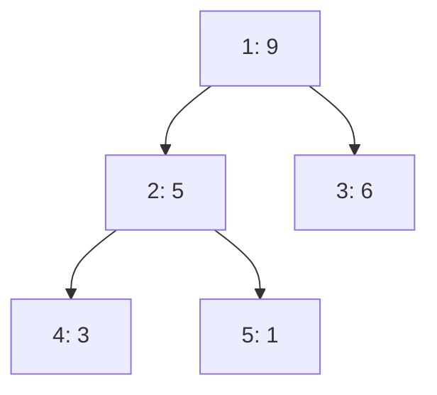
```mermaid
graph TD
  X1["1: 9"]
  X2["2: 5"]
  X3["3: 6"]
  X4["4: 3"]
  X5["5: 1"]

  X1 --> X2
  X1 --> X3
  X2 --> X4
  X2 --> X5
```

**Min-Heap**

- Chaque nœud est **plus petit ou égal** à ses enfants.
- Le **plus petit élément** est à la **racine**.

> Heapsort utilise un **max-heap**.

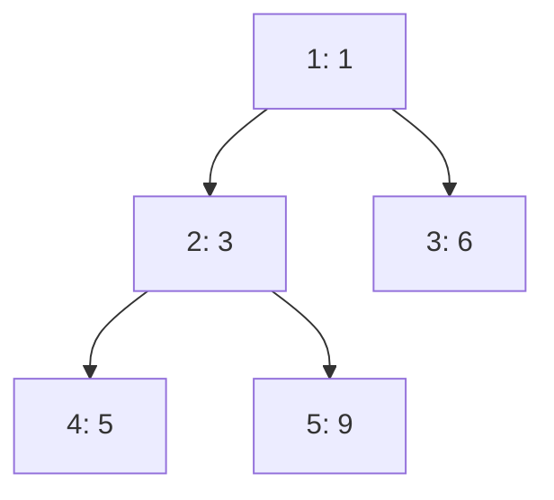
```mermaid
graph TD
  M1["1: 1"]
  M2["2: 3"]
  M3["3: 6"]
  M4["4: 5"]
  M5["5: 9"]

  M1 --> M2
  M1 --> M3
  M2 --> M4
  M2 --> M5
```

---

**Attributs importants**

- `length[A]` : nombre total d’éléments du tableau.
- `heap-size[A]` : nombre d’éléments dans le heap (peut être < length).

---

**Hauteur d’un heap**

- La hauteur d’un heap de `n` éléments est :$\lfloor \log_2 n \rfloor$

- Les opérations prennent en général `O(log n)`.

---

**Où sont les feuilles?**

- Dans un tableau de taille `n`, les **feuilles** sont les indices :

```math
\left\lfloor \frac{n}{2} \right\rfloor + 1 \text{ jusqu’à } n
```

Exemple pour `n = 10` :

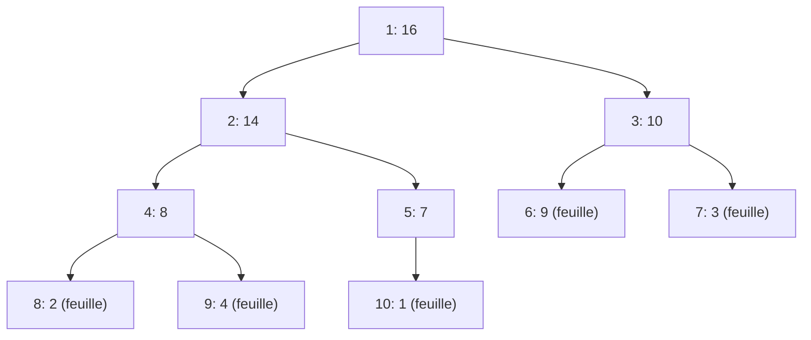
```mermaid
graph TD
  H1["1: 16"]
  H2["2: 14"]
  H3["3: 10"]
  H4["4: 8"]
  H5["5: 7"]
  H6["6: 9 (feuille)"]
  H7["7: 3 (feuille)"]
  H8["8: 2 (feuille)"]
  H9["9: 4 (feuille)"]
  H10["10: 1 (feuille)"]

  H1 --> H2
  H1 --> H3
  H2 --> H4
  H2 --> H5
  H3 --> H6
  H3 --> H7
  H4 --> H8
  H4 --> H9
  H5 --> H10
```

---

**Procédures fondamentales**

1. **MAX-HEAPIFY** : Rétablit la propriété max-heap (`O(log n)`).
2. **BUILD-MAX-HEAP** : Transforme un tableau non trié en max-heap (`O(n)`).
3. **HEAPSORT** : Trie un tableau en place (`O(n log n)`).
4. **File de priorité** (toutes en `O(log n)`) :
   - `HEAP-MAXIMUM`
   - `HEAP-EXTRACT-MAX`
   - `HEAP-INCREASE-KEY`
   - `MAX-HEAP-INSERT`

---

**Exécution pas à pas de `MAX-HEAPIFY(A, 2)`**

Sur le tableau : `A = ⟨16, 4, 10, 14, 7, 9, 3, 2, 8, 1⟩`

**🧩 Étape 0 — Arbre initial:**

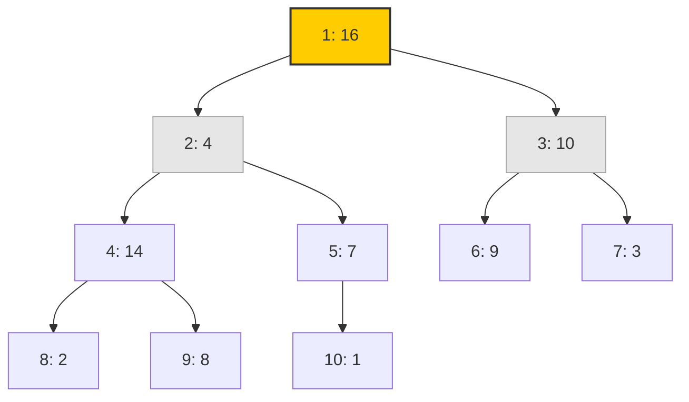
```mermaid
graph TD
  classDef root fill:#ffcc00,stroke:#333,stroke-width:2px;
  classDef child fill:#e6e6e6,stroke:#aaa,stroke-width:1px;

  A1["1: 16"]:::root
  A2["2: 4"]:::child
  A3["3: 10"]:::child
  A4["4: 14"]
  A5["5: 7"]
  A6["6: 9"]
  A7["7: 3"]
  A8["8: 2"]
  A9["9: 8"]
  A10["10: 1"]

  A1 --> A2
  A1 --> A3
  A2 --> A4
  A2 --> A5
  A3 --> A6
  A3 --> A7
  A4 --> A8
  A4 --> A9
  A5 --> A10
```

**🔄 Étape 1 — Échange 4 (index 2) avec 14 (index 4):**

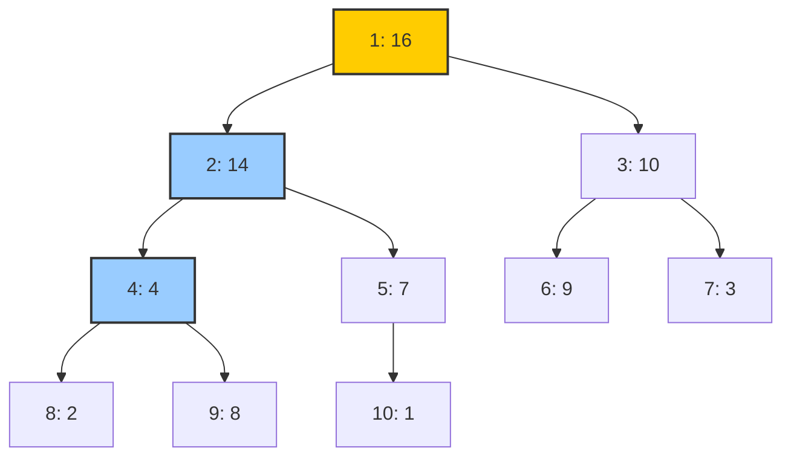
```mermaid
graph TD
  classDef root fill:#ffcc00,stroke:#333,stroke-width:2px;
  classDef updated fill:#99ccff,stroke:#333,stroke-width:2px;

  B1["1: 16"]:::root
  B2["2: 14"]:::updated
  B3["3: 10"]
  B4["4: 4"]:::updated
  B5["5: 7"]
  B6["6: 9"]
  B7["7: 3"]
  B8["8: 2"]
  B9["9: 8"]
  B10["10: 1"]

  B1 --> B2
  B1 --> B3
  B2 --> B4
  B2 --> B5
  B3 --> B6
  B3 --> B7
  B4 --> B8
  B4 --> B9
  B5 --> B10
```

**🔄 Étape 2 — Échange 4 (index 4) avec 8 (index 9):**

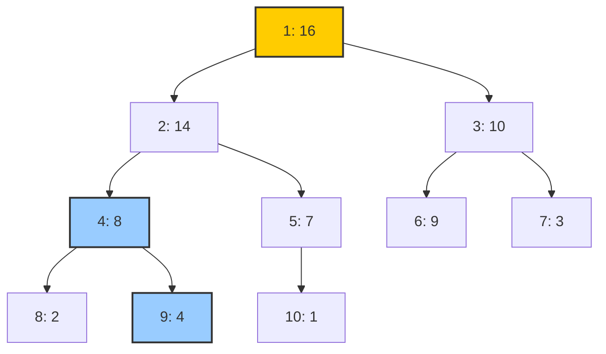
```mermaid
graph TD
  classDef root fill:#ffcc00,stroke:#333,stroke-width:2px;
  classDef updated fill:#99ccff,stroke:#333,stroke-width:2px;

  C1["1: 16"]:::root
  C2["2: 14"]
  C3["3: 10"]
  C4["4: 8"]:::updated
  C5["5: 7"]
  C6["6: 9"]
  C7["7: 3"]
  C8["8: 2"]
  C9["9: 4"]:::updated
  C10["10: 1"]

  C1 --> C2
  C1 --> C3
  C2 --> C4
  C2 --> C5
  C3 --> C6
  C3 --> C7
  C4 --> C8
  C4 --> C9
  C5 --> C10
```

### Exercices

### 6.1.1

**Q**: Nombre minimal et maximal d’éléments dans un heap de hauteur *h* ?

**R**:

- **Min** = $2^h$
- **Max** = $2^{h+1} - 1$

---

### 6.1.2

**Q**: Montrer qu’un heap de `n` éléments a une hauteur de $\lfloor \log n \rfloor$

**R**:  
Dans un arbre binaire presque complet :

```math
2^h \leq n \leq 2^{h+1} - 1 \Rightarrow h = \lfloor \log_2 n \rfloor
```

---

### 6.1.3

**Q**: Dans un max-heap, le nœud racine d’un sous-arbre contient-il la plus grande valeur ?

**R**:  
Oui, chaque parent ≥ enfants → racine du sous-arbre est le max.

---

### 6.1.4

**Q**: Où se trouve le plus petit élément (distincts) dans un max-heap ?

**R**:  
Dans les **feuilles**, car tous les parents sont plus grands.

---

### 6.1.5

**Q**: Un tableau trié en ordre croissant est-il un min-heap ?

**R**:  
Oui, chaque parent ≤ enfants → min-heap valide.

---

### 6.1.6

**Q**: La séquence ⟨23, 17, 14, 6, 13, 10, 1, 5, 7, 12⟩ est-elle un max-heap ?

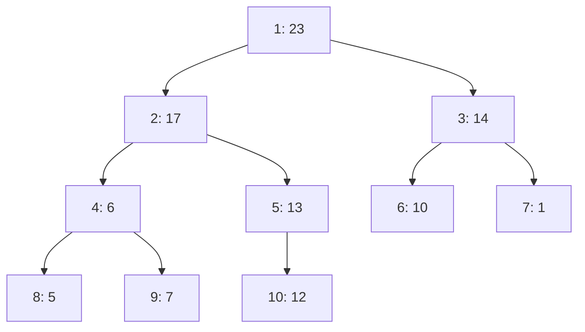
```mermaid
graph TD
  B1["1: 23"]
  B2["2: 17"]
  B3["3: 14"]
  B4["4: 6"]
  B5["5: 13"]
  B6["6: 10"]
  B7["7: 1"]
  B8["8: 5"]
  B9["9: 7"]
  B10["10: 12"]

  B1 --> B2
  B1 --> B3
  B2 --> B4
  B2 --> B5
  B3 --> B6
  B3 --> B7
  B4 --> B8
  B4 --> B9
  B5 --> B10
```

❌ Non, car 6 < 7 → violation max-heap.

---

### 6.1.7

**Q**: Montrer que les feuilles d’un heap sont aux indices ⌊n/2⌋ + 1 à n.

**R**:  
Si i > ⌊n/2⌋ → 2i > n → pas d'enfants → **feuilles**.

---

## 6.2 Maintaining the heap property

### 6.2.1 V

Using Figure 6.2 as a model, illustrate the operation of `MAX-HEAPIFY(A, 3)` on the array  
**A = (27, 17, 3, 16, 13, 10, 1, 5, 7, 12, 4, 8, 9, 0)**.

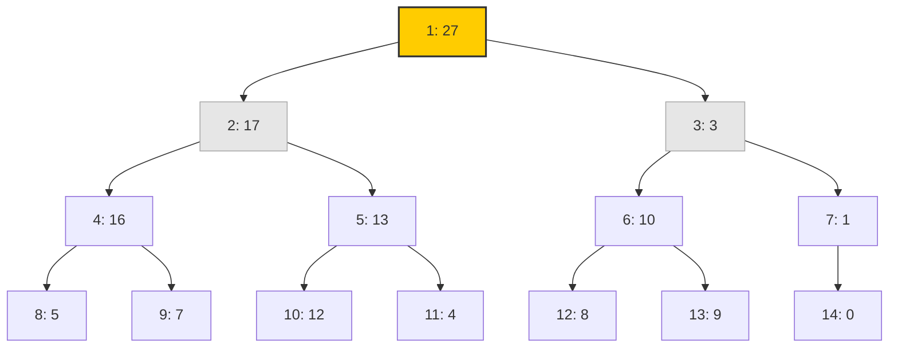
```mermaid
graph TD
  classDef root fill:#ffcc00,stroke:#333,stroke-width:2px;
  classDef child fill:#e6e6e6,stroke:#aaa,stroke-width:1px;

  A1["1: 27"]:::root
  A2["2: 17"]:::child
  A3["3: 3"]:::child
  A4["4: 16"]
  A5["5: 13"]
  A6["6: 10"]
  A7["7: 1"]
  A8["8: 5"]
  A9["9: 7"]
  A10["10: 12"]
  A11["11: 4"]
  A12["12: 8"]
  A13["13: 9"]
  A14["14: 0"]

  A1 --> A2
  A1 --> A3
  A2 --> A4
  A2 --> A5
  A3 --> A6
  A3 --> A7
  A4 --> A8
  A4 --> A9
  A5 --> A10
  A5 --> A11
  A6 --> A12
  A6 --> A13
  A7 --> A14 

```

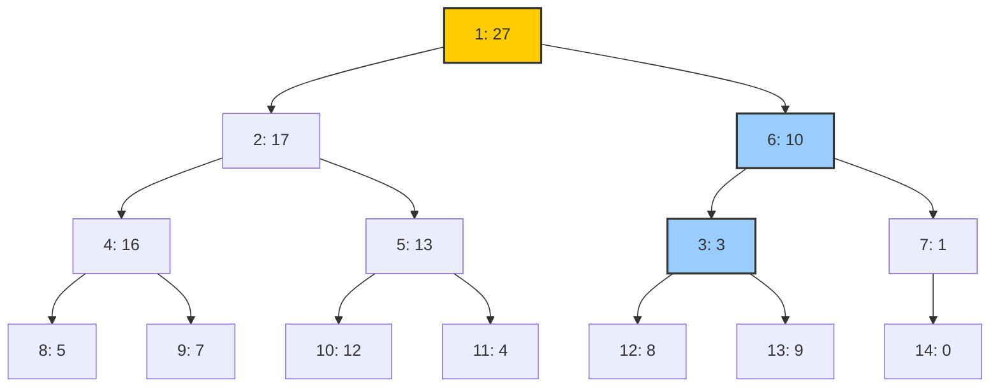
```mermaid
graph TD
  classDef root fill:#ffcc00,stroke:#333,stroke-width:2px;
  classDef updated fill:#99ccff,stroke:#333,stroke-width:2px;

  A1["1: 27"]:::root
  A2["2: 17"]
  A3["6: 10"]:::updated
  A4["4: 16"]
  A5["5: 13"]
  A6["3: 3"]:::updated
  A7["7: 1"]
  A8["8: 5"]
  A9["9: 7"]
  A10["10: 12"]
  A11["11: 4"]
  A12["12: 8"]
  A13["13: 9"]
  A14["14: 0"]

  A1 --> A2
  A1 --> A3
  A2 --> A4
  A2 --> A5
  A3 --> A6
  A3 --> A7
  A4 --> A8
  A4 --> A9
  A5 --> A10
  A5 --> A11
  A6 --> A12
  A6 --> A13
  A7 --> A14 

```

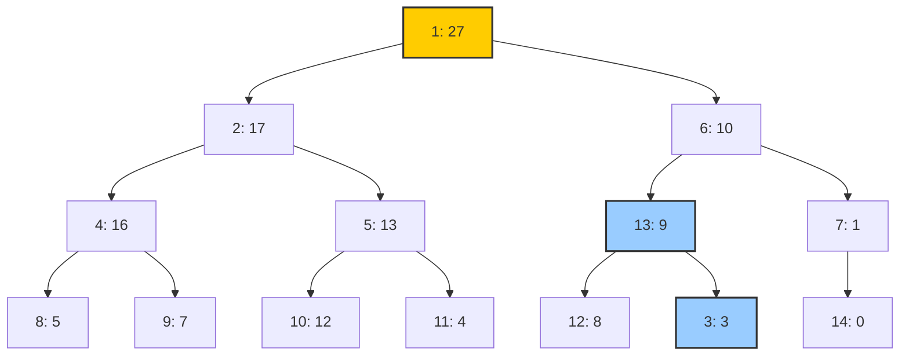
```mermaid
graph TD
  classDef root fill:#ffcc00,stroke:#333,stroke-width:2px;
  classDef updated fill:#99ccff,stroke:#333,stroke-width:2px;

  A1["1: 27"]:::root
  A2["2: 17"]
  A3["6: 10"]
  A4["4: 16"]
  A5["5: 13"]
  A6["13: 9"]:::updated
  A7["7: 1"]
  A8["8: 5"]
  A9["9: 7"]
  A10["10: 12"]
  A11["11: 4"]
  A12["12: 8"]
  A13["3: 3"]:::updated
  A14["14: 0"]

  A1 --> A2
  A1 --> A3
  A2 --> A4
  A2 --> A5
  A3 --> A6
  A3 --> A7
  A4 --> A8
  A4 --> A9
  A5 --> A10
  A5 --> A11
  A6 --> A12
  A6 --> A13
  A7 --> A14 

```

---

### 6.2.2 V

Starting with the procedure `MAX-HEAPIFY`, write python code for the procedure  
`MIN-HEAPIFY(A, i)`, which performs the corresponding manipulation on a min-heap.  
How does the running time of `MIN-HEAPIFY` compare to that of `MAX-HEAPIFY`?

---

```python

def left(i):
    return 2 * i + 1

def right(i):
    return 2 * i + 2

def max_heapify(A, i, heap_size):
    l = left(i)
    r = right(i)
    largest = i

    if l < heap_size and A[l] > A[i]:
        largest = l
    if r < heap_size and A[r] > A[largest]:
        largest = r
    if largest != i:
        A[i], A[largest] = A[largest], A[i]
        max_heapify(A, largest, heap_size)

```

```python

def left(i):
    return 2 * i + 1

def right(i):
    return 2 * i + 2

def iterative_min_heapify(A, i, heap_size):
    while True:
        l = left(i)
        r = right(i)
        smallest = i

        if l < heap_size and A[l] < A[smallest]:
            smallest = l
        if r < heap_size and A[r] < A[smallest]:
            smallest = r
        if smallest != i:
            A[i], A[smallest] = A[smallest], A[i]
            min_heapify(A, smallest, heap_size)

```

⏱️ Comparison of execution times

Le temps d'exécution de MIN-HEAPIFY est le même que celui de MAX-HEAPIFY :
O(log n) dans le pire des cas, car l'opération consiste à parcourir une hauteur maximale du tas binaire.

### 6.2.3 V

What is the effect of calling `MAX-HEAPIFY(A, i)` when the element `A[i]` is larger than its children?

Rien ne se passe, car le sous-arbre enraciné en `i` respecte déjà la propriété de max-heap.
L'élément `A[i]` est plus grand que ses enfants, donc aucun échange n’est nécessaire.
La fonction s'arrête immédiatement après avoir constaté que l'ordre est correct.

---

### 6.2.4 V

What is the effect of calling `MAX-HEAPIFY(A, i)` for `i > heap-size[A]/2`?

Rien ne se passe, car les indices `i > heap-size[A] / 2` correspondent aux **feuilles** du tas binaire.
Les feuilles n'ont pas d'enfants, donc la propriété de max-heap est automatiquement satisfaite à ces positions.
`MAX-HEAPIFY` détecte qu'il n'y a pas d’enfants valides à comparer et s'arrête immédiatement.

---

### 6.2.5 V

The code for `MAX-HEAPIFY` is quite efficient in terms of constant factors, except possibly for the recursive call ``max_heapify(A, largest, heap_size)``, which might cause some compilers to produce inefficient code. Write an efficient `MAX-HEAPIFY` that uses an iterative control construct (a loop) instead of recursion.

```python

def left(i):
    return 2 * i + 1

def right(i):
    return 2 * i + 2

def max_heapify(A, i, heap_size):
    l = left(i)
    r = right(i)
    largest = i

    if l < heap_size and A[l] > A[i]:
        largest = l
    if r < heap_size and A[r] > A[largest]:
        largest = r
    if largest != i:
        A[i], A[largest] = A[largest], A[i]
        max_heapify(A, largest, heap_size)

```

```python

def left(i):
    return 2 * i + 1

def right(i):
    return 2 * i + 2

def iterative_max_heapify(A, i, heap_size):
    l = left(i)
    r = right(i)
    largest = i

    if l < heap_size and A[l] > A[i]:
        largest = l
    if r < heap_size and A[r] > A[largest]:
        largest = r
    if largest != i:
        A[i], A[largest] = A[largest], A[i]
        i= largest
    else
      break

def build_max_heap(A):
    heap_size = len(A)
    i = (heap_size // 2) - 1  # dernier nœud interne

    while i >= 0:
        iterative_max_heapify(A, i, heap_size)
        i -= 1

# Exemple d'utilisation
A = [3, 9, 2, 1, 4, 5]
print("Avant : ", A)
build_max_heap(A)
print("Après : ", A)

```

---

### 6.2.6 N

Show that the worst-case running time of `MAX-HEAPIFY` on a heap of size `n` is **Ω(log n)**.(**Hint**: For a heap with `n` nodes, give node values that cause `MAX-HEAPIFY` to be called recursively at every node on a path from the root down to a leaf.)

```python

def left(i):
    return 2 * i + 1

def right(i):
    return 2 * i + 2

def max_heapify(A, i, heap_size):
    l = left(i)
    r = right(i)
    largest = i

    if l < heap_size and A[l] > A[i]:
        largest = l
    if r < heap_size and A[r] > A[largest]:
        largest = r
    if largest != i:
        A[i], A[largest] = A[largest], A[i]
        max_heapify(A, largest, heap_size)

```

## 6.3 Building a heap

### Résume de cour
---

**Objectif**

Construire un **max-heap** à partir d’un tableau non trié `A[1..n]` en utilisant la procédure `MAX-HEAPIFY` de manière **ascendante** (bottom-up).

---

**Principe**

* Les éléments de l’intervalle `A[⌊n/2⌋ + 1 .. n]` sont **toutes des feuilles** → ils sont déjà des mini-heaps.
* Le reste des éléments (nœuds internes) doivent être traités avec `MAX-HEAPIFY`.

---

**Procédure `BUILD-MAX-HEAP`**

```python
def build_max_heap(A):
    heap_size = len(A)
    for i in range((heap_size // 2) - 1, -1, -1):
        max_heapify(A, i, heap_size)
```

* `heap_size` est initialisé à `n`.
* On applique `MAX-HEAPIFY` depuis le dernier nœud interne (`n//2`) jusqu’à la racine (`1`).

---

**Invariant de boucle**

> Avant chaque itération, les nœuds `i+1, i+2, ..., n` sont les racines de max-heaps.

**Justification :**

* **Initialisation** : Tous les nœuds après `n//2` sont des feuilles → max-heaps triviales.
* **Maintien** : Les enfants de `i` sont plus grands que `i` → `MAX-HEAPIFY` assure que `i` devient aussi racine d’un max-heap.
* **Terminaison** : À la fin, tous les nœuds `1 à n` forment un max-heap, y compris la racine.

---

**Complexité**

**Estimation simple :**

* `O(log n)` pour chaque `MAX-HEAPIFY`, appliqué à `O(n)` nœuds → **`O(n log n)`**.

**Analyse fine :**

* La profondeur d’un nœud détermine le coût de `MAX-HEAPIFY`.
* Très peu de nœuds ont une grande hauteur → la somme converge :

$$
\sum_{h=0}^{\lfloor \log n \rfloor} \frac{n}{2^{h+1}} \cdot O(h) = O(n)
$$

**Conclusion :**

> **`BUILD-MAX-HEAP` s’exécute en temps linéaire : `O(n)`**

---
### Exercices

#### 6.3.1 V
Using Figure 6.3 as a model, illustrate the operation of `BUILD-MAX-HEAP` on the array  
**A = [5, 3, 17, 10, 84, 19, 6, 22, 9]**.

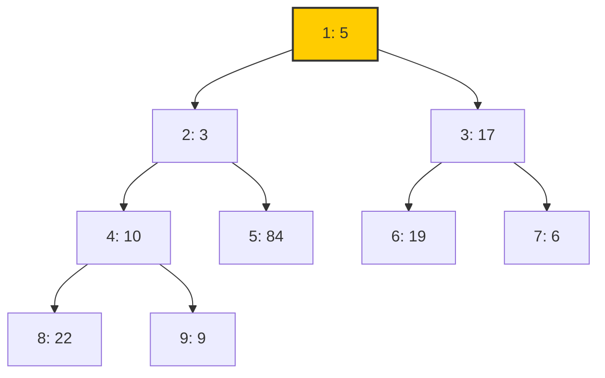
```mermaid
graph TD
  classDef root fill:#ffcc00,stroke:#333,stroke-width:2px;

  A1["1: 5"]:::root
  A2["2: 3"]
  A3["3: 17"]
  A4["4: 10"]
  A5["5: 84"]
  A6["6: 19"]
  A7["7: 6"]
  A8["8: 22"]
  A9["9: 9"]


  A1 --> A2
  A1 --> A3

  A2 --> A4
  A2 --> A5

  A3 --> A6
  A3 --> A7

  A4 --> A8
  A4 --> A9


```

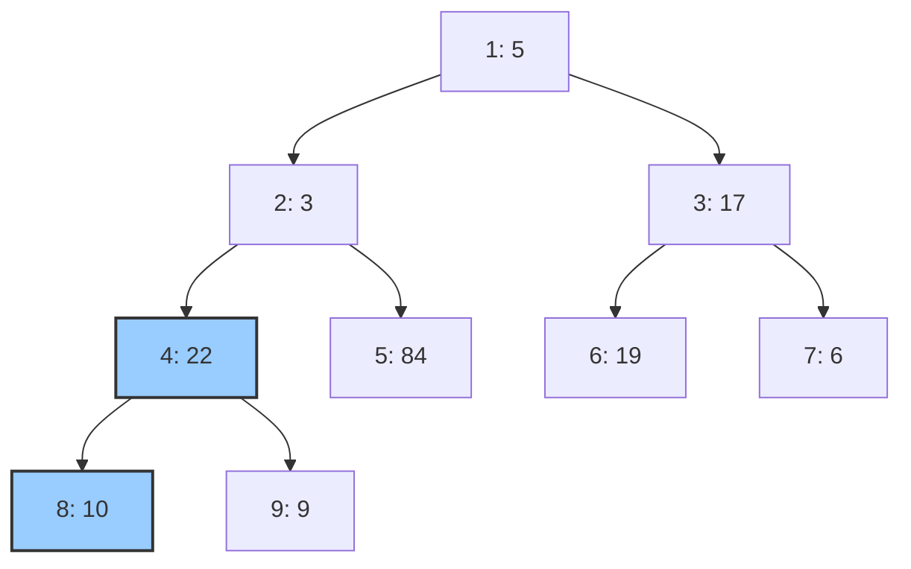
```mermaid
graph TD
  classDef root fill:#ffcc00,stroke:#333,stroke-width:2px;
  classDef updated fill:#99ccff,stroke:#333,stroke-width:2px;

  A1["1: 5"]
  A2["2: 3"]
  A3["3: 17"]
  A4["4: 22"]:::updated
  A5["5: 84"]
  A6["6: 19"]
  A7["7: 6"]
  A8["8: 10"]:::updated
  A9["9: 9"]

  A1 --> A2
  A1 --> A3

  A2 --> A4
  A2 --> A5

  A3 --> A6
  A3 --> A7

  A4 --> A8
  A4 --> A9
```

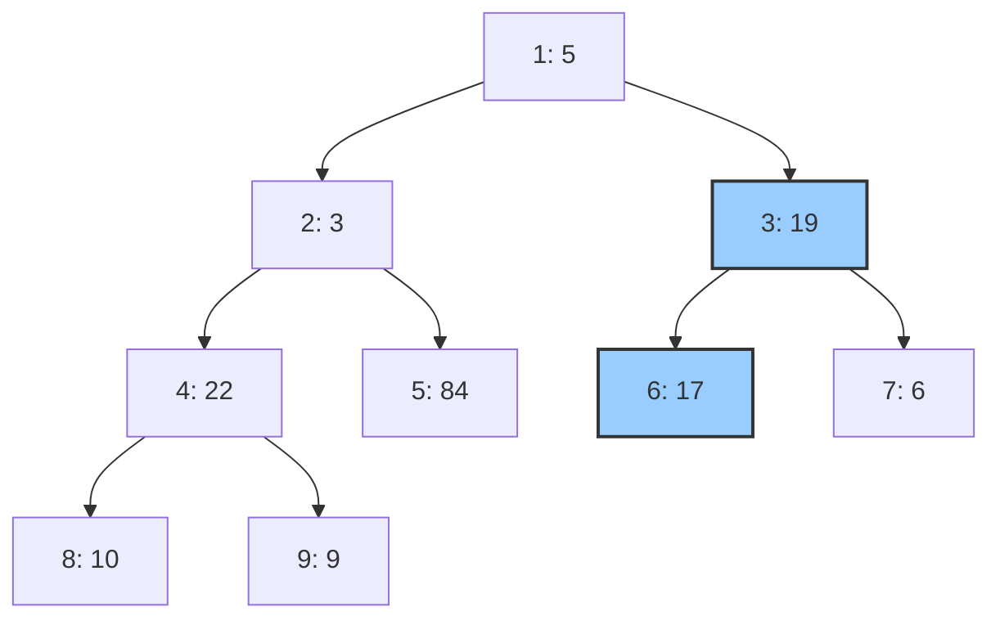
```mermaid
graph TD
  classDef root fill:#ffcc00,stroke:#333,stroke-width:2px;
  classDef updated fill:#99ccff,stroke:#333,stroke-width:2px;

  A1["1: 5"]
  A2["2: 3"]
  A3["3: 19"]:::updated
  A4["4: 22"]
  A5["5: 84"]
  A6["6: 17"]:::updated
  A7["7: 6"]
  A8["8: 10"]
  A9["9: 9"]

  A1 --> A2
  A1 --> A3
  A2 --> A4
  A2 --> A5
  A3 --> A6
  A3 --> A7
  A4 --> A8
  A4 --> A9
```

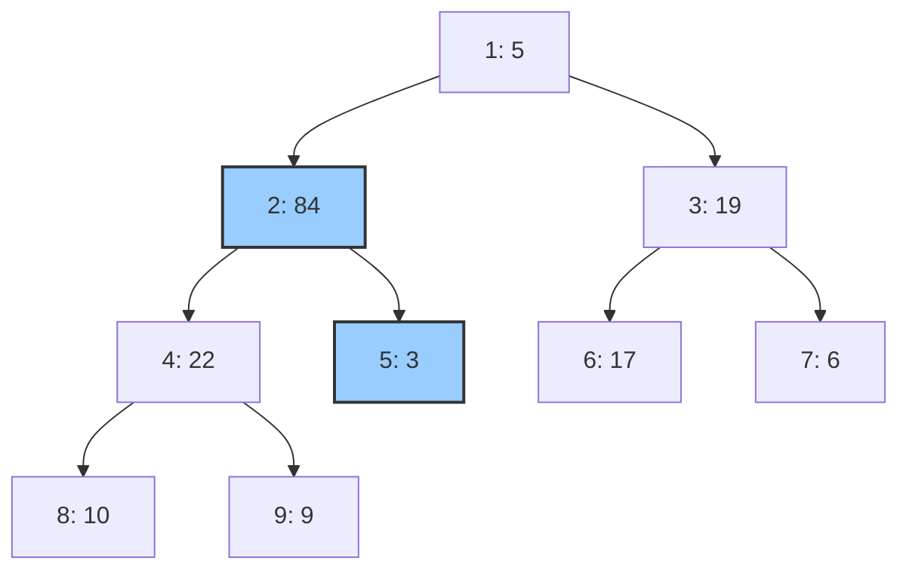
```mermaid
graph TD
  classDef root fill:#ffcc00,stroke:#333,stroke-width:2px;
  classDef updated fill:#99ccff,stroke:#333,stroke-width:2px;

  A1["1: 5"]
  A2["2: 84"]:::updated
  A3["3: 19"]
  A4["4: 22"]
  A5["5: 3"]:::updated
  A6["6: 17"]
  A7["7: 6"]
  A8["8: 10"]
  A9["9: 9"]

  A1 --> A2
  A1 --> A3
  A2 --> A4
  A2 --> A5
  A3 --> A6
  A3 --> A7
  A4 --> A8
  A4 --> A9
```

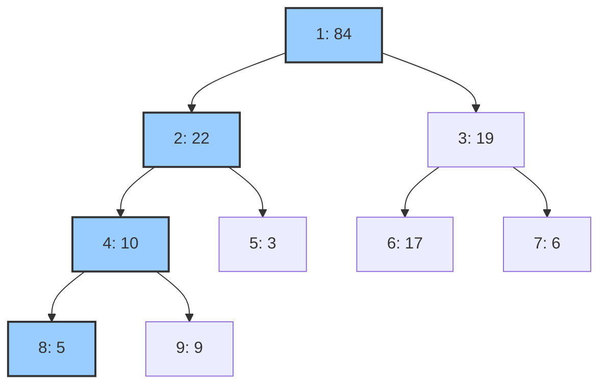
```mermaid
graph TD
  classDef root fill:#ffcc00,stroke:#333,stroke-width:2px;
  classDef updated fill:#99ccff,stroke:#333,stroke-width:2px;

  A1["1: 84"]:::updated
  A2["2: 22"]:::updated
  A3["3: 19"]
  A4["4: 10"]:::updated
  A5["5: 3"]
  A6["6: 17"]
  A7["7: 6"]
  A8["8: 5"]:::updated
  A9["9: 9"]

  A1 --> A2
  A1 --> A3
  A2 --> A4
  A2 --> A5
  A3 --> A6
  A3 --> A7
  A4 --> A8
  A4 --> A9
```

---

#### 6.3.2 V

Why do we want the loop index `i` in line 2 of `BUILD-MAX-HEAP` to decrease from `⌊length[A]/2⌋` to 1 rather than increase from 1 to `⌊length[A]/2⌋`?

```python
def build_max_heap(A):
    heap_size = len(A)
    for i in range((heap_size // 2) - 1, -1, -1):
        max_heapify(A, i, heap_size)
```

On parcourt les nœuds internes de bas en haut (de l’indice `[n/2]` vers 0), car l’algorithme `MAX-HEAPIFY` suppose que les sous-arbres des enfants du nœud `i` respectent déjà la propriété de tas.

Si on parcourait les nœuds de haut en bas (de 1 à `⌊n/2⌋`), on risquerait d'appeler `MAX-HEAPIFY` sur un nœud dont les enfants n'ont pas encore été transformés en tas, ce qui invaliderait l'invariant nécessaire à `MAX-HEAPIFY` pour fonctionner correctement.

En commençant par les nœuds les plus profonds, on s’assure que chaque appel à `MAX-HEAPIFY` agit sur des sous-arbres déjà bien formés, ce qui garantit la construction correcte du tas max.

#### 6.3.3 V

Show that there are at most `⌈n / 2^(h+1)⌉` nodes of height `h` in any `n`-element heap.

**Explication :**

Dans un **tas binaire**, les nœuds sont arrangés dans un arbre **binaire complet**, ce qui signifie que toutes les couches sont remplies de gauche à droite.

- La **hauteur** d’un nœud est définie comme la distance (en nombre d’arêtes) entre ce nœud et sa **feuille la plus éloignée**.
- Le **niveau** 0 est constitué des feuilles (hauteur 0), le niveau supérieur a des nœuds de hauteur 1, et ainsi de suite.

---

**Observation clé :**

À chaque niveau que l'on remonte, **le nombre maximal de nœuds est divisé par 2**, car chaque parent a au plus 2 enfants.

Ainsi, le nombre maximal de nœuds de **hauteur `h`** est borné par le nombre total de nœuds divisés par `2^(h+1)`.

Pourquoi `h+1` et pas `h` ?  
Parce qu'un nœud de hauteur `h` est à **`h` niveaux au-dessus d'une feuille**, donc les feuilles sont à une profondeur de `log₂(n)` et les nœuds de hauteur `h` sont `h` niveaux au-dessus.

---

**Conclusion :**

Il y a au plus ⌈n / 2^(h+1)⌉ nœuds de hauteur `h` dans un tas de `n` éléments.

Cela vient du fait que la moitié des nœuds sont à la hauteur 0 (feuilles), un quart à la hauteur 1, un huitième à la hauteur 2, etc.

## 6.4 The heapsort algorithm

### Résume de cour

L’algorithme **Heapsort** trie un tableau en deux étapes principales :

---

**1. Construction du tas max**

- On utilise la fonction `BUILD-MAX-HEAP(A)` pour transformer le tableau d’entrée en un **tas max**.
- Dans un tas max, le plus grand élément est à la racine (`A[0]` en Python).
- Cette étape prend un **temps linéaire** : `O(n)`.

---

***2. Extraction répétée du maximum**

À chaque itération du tri :

- On **échange** l’élément le plus grand (en tête du tableau) avec le dernier élément non trié.
- On **réduit** la taille du tas (en ignorant la dernière case désormais triée).
- On appelle `MAX-HEAPIFY` sur la racine pour **restaurer la propriété de tas**.

Ce processus est répété jusqu’à ce que le tableau soit entièrement trié.

---

***Complexité**

- `BUILD-MAX-HEAP` → **O(n)**
- `MAX-HEAPIFY` (appelé n − 1 fois) → **O(log n)**  
**Temps total : O(n log n)**  
**Tri en place et sans mémoire supplémentaire**

---

**Code Python de Heapsort**

```python
def max_heapify(A, i, heap_size):
    left = 2 * i + 1
    right = 2 * i + 2
    largest = i

    if left < heap_size and A[left] > A[largest]:
        largest = left
    if right < heap_size and A[right] > A[largest]:
        largest = right

    if largest != i:
        A[i], A[largest] = A[largest], A[i]
        max_heapify(A, largest, heap_size)

def build_max_heap(A):
    heap_size = len(A)
    for i in range((heap_size // 2) - 1, -1, -1):
        max_heapify(A, i, heap_size)

def heapsort(A):
    build_max_heap(A)
    heap_size = len(A)
    for i in range(len(A) - 1, 0, -1):
        A[0], A[i] = A[i], A[0]
        heap_size -= 1
        max_heapify(A, 0, heap_size)

```

### Exercices

#### 6.4.1 N

Using Figure 6.4 as a model, illustrate the operation of HEAPSORT on the array:

A = [5, 13, 2, 25, 7, 17, 20, 8, 4]

---

#### 6.4.2 N

Argue the correctness of HEAPSORT using the following loop invariant:

At the start of each iteration of the for loop of lines 2–5, the subarray `A[1 .. i]` is a max-heap containing the i smallest elements of `A[1 .. n]`, and the subarray `A[i + 1 .. n]` contains the n − i largest elements of `A[1 .. n]`, sorted.

---

#### 6.4.3 N

What is the running time of heapsort on an array A of length n that is already sorted in increasing order? What about decreasing order?

---

#### 6.4.4 N

Show that the worst-case running time of heapsort is β(n lg n).

## 6.5 Priority queues

### Résumé de cour

**Contexte**

Même si **Heapsort** est performant, en pratique, un bon **Quicksort** le surpasse souvent.  
Cependant, la structure de **tas** reste très utile, notamment pour implémenter des **files de priorité efficaces**.

---

**Objectif : File de priorité**

Une **file de priorité** gère un ensemble d’éléments, chacun associé à une **clé** (valeur de priorité).

Deux types :
- **Max-priority queue** (file de priorité maximale) : priorité au plus grand
- **Min-priority queue** : priorité au plus petit (utilisée en simulation, algos de graphes, etc.)

---

**Opérations supportées (max-priority queue)**

| Opération | Description |
|----------|-------------|
| `INSERT(S, x)` | Insère un élément `x` dans l'ensemble `S` |
| `MAXIMUM(S)` | Renvoie l’élément avec la clé maximale |
| `EXTRACT-MAX(S)` | Supprime et renvoie l’élément avec la clé maximale |
| `INCREASE-KEY(S, x, k)` | Augmente la clé de `x` à `k` (`k ≥ clé(x)`) |

---

**Exemples d'applications**

- **Planification de tâches** sur un ordinateur partagé
- **Simulation d’événements** (avec min-priority queue)

---

**Implémentation avec un tas max**

Chaque élément du tas peut contenir un **handle** vers son objet applicatif, et inversement.  
Lors des échanges dans le tableau, les **indices doivent être mis à jour** dans les objets liés.

---

**Fonctions principales (avec complexité)**

```python
def heap_maximum(A):
    return A[0]  # O(1)

def heap_extract_max(A, heap_size):
    if heap_size < 1:
        raise Exception("heap underflow")
    max_val = A[0]
    A[0] = A[heap_size - 1]
    heap_size -= 1
    max_heapify(A, 0, heap_size)
    return max_val  # O(log n)

def heap_increase_key(A, i, key):
    if key < A[i]:
        raise Exception("new key is smaller than current key")
    A[i] = key
    while i > 0 and A[parent(i)] < A[i]:
        A[i], A[parent(i)] = A[parent(i)], A[i]
        i = parent(i)  # O(log n)

def max_heap_insert(A, key, heap_size):
    heap_size += 1
    A.append(float("-inf"))
    heap_increase_key(A, heap_size - 1, key)  # O(log n)
    
```

---

**Complexité des opérations**

| Opération         | Complexité |
| ----------------- | ---------- |
| `MAXIMUM`         | O(1)       |
| `EXTRACT-MAX`     | O(log n)   |
| `INCREASE-KEY`    | O(log n)   |
| `MAX-HEAP-INSERT` | O(log n)   |

---

**Résumé final**

Un **tas** permet d’implémenter efficacement une **file de priorité** avec des opérations logarithmiques en temps.
Les **max-heaps** servent aux priorités maximales, tandis que les **min-heaps** sont utiles pour les simulations temporelles et algorithmes comme Dijkstra (chapitres 23 et 24).

### Exercices

#### 6.5.1

Illustrate the operation of ``HEAP-EXTRACT-MAX`` on the heap:

``A = [15, 13, 9, 5, 12, 8, 7, 4, 0, 6, 2, 1]``

---

**Initial Max-Heap**

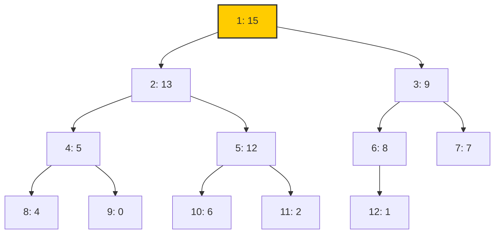
```mermaid
graph TD
  classDef root fill:#ffcc00,stroke:#333,stroke-width:2px;

  A1["1: 15"]:::root
  A2["2: 13"]
  A3["3: 9"]
  A4["4: 5"]
  A5["5: 12"]
  A6["6: 8"]
  A7["7: 7"]
  A8["8: 4"]
  A9["9: 0"]
  A10["10: 6"]
  A11["11: 2"]
  A12["12: 1"]

  A1 --> A2
  A1 --> A3

  A2 --> A4
  A2 --> A5

  A3 --> A6
  A3 --> A7

  A4 --> A8
  A4 --> A9

  A5 --> A10
  A5 --> A11

  A6 --> A12
```

---

**After Swapping Root and Last Element**

`A = [1, 13, 9, 5, 12, 8, 7, 4, 0, 6, 2, 15]`

Max element `15` is removed (stored), and `MAX-HEAPIFY` will now be called on index `1`.

---

**After MAX-HEAPIFY**

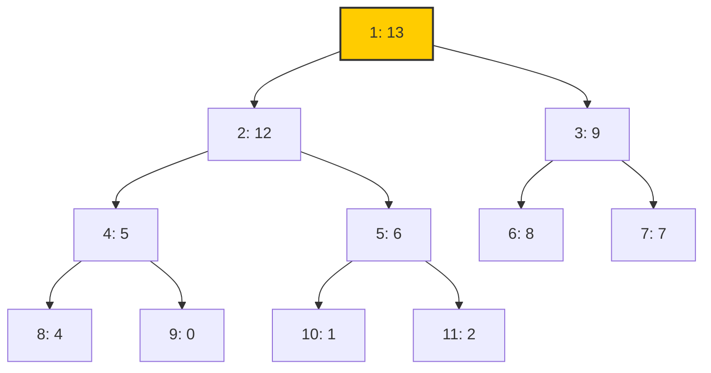
```mermaid
graph TD
  classDef root fill:#ffcc00,stroke:#333,stroke-width:2px;

  B1["1: 13"]:::root
  B2["2: 12"]
  B3["3: 9"]
  B4["4: 5"]
  B5["5: 6"]
  B6["6: 8"]
  B7["7: 7"]
  B8["8: 4"]
  B9["9: 0"]
  B10["10: 1"]
  B11["11: 2"]

  B1 --> B2
  B1 --> B3

  B2 --> B4
  B2 --> B5

  B3 --> B6
  B3 --> B7

  B4 --> B8
  B4 --> B9

  B5 --> B10
  B5 --> B11
```

> Résultat : `15` est extrait, et l'arbre est à nouveau un max-heap.

---

#### 6.5.2

Illustrate the operation of ``MAX-HEAP-INSERT(A, 10)`` on the heap:
``A = [15, 13, 9, 5, 12, 8, 7, 4, 0, 6, 2, 1]``

We append `-∞` to the array, then call `HEAP-INCREASE-KEY` to set it to `10` and bubble it up.

---

**Step 1: Append -∞**
`A = [15, 13, 9, 5, 12, 8, 7, 4, 0, 6, 2, 1, -∞]`

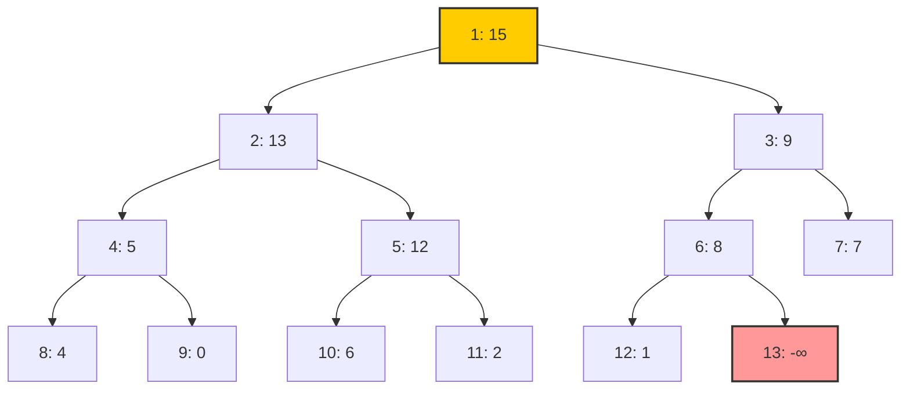
```mermaid
graph TD
  classDef new fill:#f99,stroke:#333,stroke-width:2px;
  classDef root fill:#ffcc00,stroke:#333,stroke-width:2px;

  A1["1: 15"]:::root
  A2["2: 13"]
  A3["3: 9"]
  A4["4: 5"]
  A5["5: 12"]
  A6["6: 8"]
  A7["7: 7"]
  A8["8: 4"]
  A9["9: 0"]
  A10["10: 6"]
  A11["11: 2"]
  A12["12: 1"]
  A13["13: -∞"]:::new

  A1 --> A2
  A1 --> A3

  A2 --> A4
  A2 --> A5

  A3 --> A6
  A3 --> A7

  A4 --> A8
  A4 --> A9

  A5 --> A10
  A5 --> A11

  A6 --> A12
  A6 --> A13
```

---

**Step 2: Increase Key to 10 and Bubble Up**
`A[13] = 10`, bubble up via swaps:

- Swap with parent `A[6] = 8` → `A[6] = 10`, `A[13] = 8`
- Now `A[3] = 9`, since `10 > 9` → Swap `A[3]` and `A[6]`

Final heap:

`A = [15, 13, 10, 5, 12, 9, 7, 4, 0, 6, 2, 1, 8]`

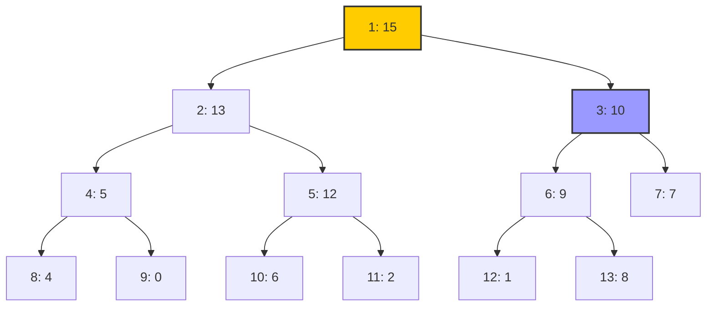
```mermaid
graph TD
  classDef inserted fill:#99f,stroke:#333,stroke-width:2px;
  classDef root fill:#ffcc00,stroke:#333,stroke-width:2px;

  B1["1: 15"]:::root
  B2["2: 13"]
  B3["3: 10"]:::inserted
  B4["4: 5"]
  B5["5: 12"]
  B6["6: 9"]
  B7["7: 7"]
  B8["8: 4"]
  B9["9: 0"]
  B10["10: 6"]
  B11["11: 2"]
  B12["12: 1"]
  B13["13: 8"]

  B1 --> B2
  B1 --> B3

  B2 --> B4
  B2 --> B5

  B3 --> B6
  B3 --> B7

  B4 --> B8
  B4 --> B9

  B5 --> B10
  B5 --> B11

  B6 --> B12
  B6 --> B13
```

---

> Résultat : `10` est inséré et a remonté jusqu'à la bonne position pour rétablir la propriété de max-heap.

---

#### 6.5.3

Write pseudocode for the procedures HEAP-MINIMUM, HEAP-EXTRACT-MIN, HEAP-DECREASE-KEY, and MIN-HEAP-INSERT that implement a min-priority queue with a min-heap.

---

#### 6.5.4

Why do we bother setting the key of the inserted node to −∞ in line 2 of MAX-HEAP-INSERT when the next thing we do is increase its key to the desired value?

---

#### 6.5.5

Argue the correctness of HEAP-INCREASE-KEY using the following loop invariant:

At the start of each iteration of the while loop of lines 4–6, the array `A[1 .. heap-size[A]]` satisfies the max-heap property, except that there may be one violation: `A[i]` may be larger than `A[PARENT(i)]`.

---

#### 6.5.6

Show how to implement a first-in, first-out queue with a priority queue. Show how to implement a stack with a priority queue. (Queues and stacks are defined in Section 10.1.)

---

#### 6.5.7

The operation HEAP-DELETE(A, i) deletes the item in node i from heap A. Give an implementation of HEAP-DELETE that runs in O(lg n) time for an n-element max-heap.

---

#### 6.5.8

Give an O(n lg k)-time algorithm to merge k sorted lists into one sorted list, where n is the total number of elements in all the input lists. (Hint: Use a min-heap for k-way merging.)

# 7. Quicksort

## 7.1 Description of quicksort

### Résumer de cour

Quicksort est un algorithme de tri basé sur le paradigme **diviser-pour-régner**. On y distingue trois phases pour trier un sous-tableau `A[p..r]` :

1. **Diviser** – `PARTITION(A, p, r)`  
   - Choisit un **pivot** `x = A[r]`.  
   - Réarrange `A[p..r]` en deux sous-tableaux `A[p..q−1]` (éléments ≤ `x`) et `A[q+1..r]` (éléments ≥ `x`).  
   - Retourne l’indice `q` où se trouve le pivot à la fin.

2. **Conquérir** – Appels récursifs

```python

quicksort(A, p, q−1)
quicksort(A, q+1, r)

```

Chacun trie l’un des deux sous-tableaux créés.

1. **Combiner** – Aucun travail supplémentaire  
Comme le tri est fait *in‑place*, les deux moitiés triées forment directement `A[p..r]` trié.

---

**Procédure QUICKSORT**

```python

def quicksort(A, p, r):
    """
    Trie le sous-tableau A[p..r] en place selon l'algorithme QuickSort.
    """
    if p < r:
        q = partition(A, p, r)
        quicksort(A, p, q - 1)
        quicksort(A, q + 1, r)

 
```

* Pour trier tout le tableau `A` de taille `n` :

```python

def quicksort_inplace(A):
    """
    Wrapper pour trier tout le tableau A en place.
    """
    quicksort(A, 0, len(A) - 1)
```

---

**Procédure PARTITION**

```python
def partition(A, p, r):
    """
    Partitionne le sous-tableau A[p..r] autour du pivot A[r].
    Retourne l'indice q tel que A[p..q-1] <= pivot <= A[q+1..r].
    """
    x = A[r]
    i = p - 1
    for j in range(p, r):
        if A[j] <= x:
            i += 1
            A[i], A[j] = A[j], A[i]
    A[i+1], A[r] = A[r], A[i+1]
    return i + 1

```

* **Pivot** : on utilise toujours `A[r]`.
* **Indices** :

  * `i` marque la fin de la zone « petits éléments » (≤ `x`).
  * `j` parcourt les éléments à tester.

**Invariant de boucle**

À chaque début d’itération (pour `j` entre `p` et `r−1`) :

1. Pour tout `k ∈ [p..i]`, `A[k] ≤ x`.
2. Pour tout `k ∈ [i+1..j−1]`, `A[k] > x`.
3. `A[r] = x` (pivot toujours en fin).

* **Initialisation** : `i = p−1`, `j = p` ⇒ zones vides, pivot en place.
* **Maintenance** :

  * Si `A[j] > x`, on incrémente `j`.
  * Si `A[j] ≤ x`, on incrémente `i`, échange `A[i]` et `A[j]`, puis incrémente `j`.
* **Termination** : `j = r` ⇒ tous les éléments sont classés en « ≤ x » ou « > x ».
  On place enfin le pivot entre les deux zones (échange ligne 7–8).

---

**Complexité**

* Chaque appel à **PARTITION** sur `n = r−p+1` éléments prend Θ(n) (voir exercice 7.1‑3).
* Le coût total dépend du choix des pivots et du partage des sous‑tableaux (meilleur, moyen, pire cas).

### Exercises

#### 7.1.1 V

Using Figure 7.1 as a model, illustrate the operation of the `PARTITION` procedure on the array:  
`A = ⟨13, 19, 9, 5, 12, 8, 7, 4, 11, 2, 6, 21⟩`

<!DOCTYPE html>
<html lang="en">
<head>
  <meta charset="UTF-8">
  <title>Partition Trace</title>
  <style>
    .partition { border-collapse: collapse; margin: 1em 0; }
    .partition td { border: 1px solid #666; width: 2em; height: 2em; text-align: center; }
    .leq   { background-color: #d1e7dd; }   /* ≤ pivot */
    .gt    { background-color:rgb(235, 34, 54); }   /* > pivot */
    .pivot { background-color: #cff4fc; }   /* pivot */
    .ptr   { border: none; font-size: 0.8em; color: #333; }
    .step-label { font-weight: bold; margin-top: 1em; }
  </style>
</head>
<body>

  <!-- Step (a) -->
  <div class="step-label">(a) i=-1,j=0,p=0</div>
  <table class="partition">
    <tr class="ptr">
      <td>i,p,j</td>
      <td colspan="10"></td>
      <td>r</td>
    </tr>
    <tr>
      <td>13</td>
      <td>19</td>
      <td>9</td>
      <td>5</td>
      <td>12</td>
      <td>8</td>
      <td>7</td>
      <td>4</td>
      <td>11</td>
      <td>2</td>
      <td>6</td>
      <td class="pivot">21</td>
    </tr>
  </table>

  <!-- Step (b) -->
  <div class="step-label">(b) A[j=0]=13 ≤21 → i=0 → swap A[i=0] and A[j=0] → j=1</div>
  <table class="partition">
    <tr class="ptr">
      <td>i,p</td>
      <td>j</td>
      <td colspan="9"></td>
      <td>r</td>
    </tr>
    <tr>
      <td class="leq">13</td>
      <td>19</td>
      <td>9</td>
      <td>5</td>
      <td>12</td>
      <td>8</td>
      <td>7</td>
      <td>4</td>
      <td>11</td>
      <td>2</td>
      <td>6</td>
      <td class="pivot">21</td>
    </tr>
  </table>

  <!-- Step (c) -->
  <div class="step-label">(c) A[j=1]=19 ≤21 → i=1 → swap A[i=1] and A[j=1] → j=2</div>
  <table class="partition">
    <tr class="ptr">
      <td>p</td>
      <td>i</td>
      <td>j</td>
      <td colspan="8"></td>
      <td>r</td>
    </tr>
    <tr>
      <td class="leq">13</td>
      <td class="leq">19</td>
      <td>9</td>
      <td>5</td>
      <td>12</td>
      <td>8</td>
      <td>7</td>
      <td>4</td>
      <td>11</td>
      <td>2</td>
      <td>6</td>
      <td class="pivot">21</td>
    </tr>
  </table>

  <!-- Step (d) -->
  <div class="step-label">(d) A[j=2]=9 ≤21 → i=2 → swap A[i=2] and A[j=2] → j=3</div>
  <table class="partition">
    <tr class="ptr">
      <td>p</td>
      <td colspan="1"></td>
      <td>i</td>
      <td>j</td>
      <td colspan="7"></td>
      <td>r</td>
    </tr>
    <tr>
      <td class="leq">13</td>
      <td class="leq">19</td>
      <td class="leq">9</td>
      <td>5</td>
      <td>12</td>
      <td>8</td>
      <td>7</td>
      <td>4</td>
      <td>11</td>
      <td>2</td>
      <td>6</td>
      <td class="pivot">21</td>
    </tr>
  </table>

  <!-- Step (e) -->
  <div class="step-label">(e) A[j=3]=5 ≤21 → i=3 → swap A[i=3] and A[j=3] → j=4</div>
  <table class="partition">
    <tr class="ptr">
      <td>p</td>
      <td colspan="2"></td>
      <td>i</td>
      <td>j</td>
      <td colspan="6"></td>
      <td>r</td>
    </tr>
    <tr>
      <td class="leq">13</td>
      <td class="leq">19</td>
      <td class="leq">9</td>
      <td class="leq">5</td>
      <td>12</td>
      <td>8</td>
      <td>7</td>
      <td>4</td>
      <td>11</td>
      <td>2</td>
      <td>6</td>
      <td class="pivot">21</td>
    </tr>
  </table>

  <!-- Step (pre-final) -->
  <div class="step-label">(pre_final) A[j=10]=6 ≤21 → i=10 → swap A[i=10] and A[j=10]</div>
  <table class="partition">
    <tr class="ptr">
      <td>p</td>
      <td colspan="8"></td>
      <td>i</td>
      <td>j</td>
      <td>r</td>
    </tr>
    <tr>
      <td class="leq">13</td>
      <td class="leq">19</td>
      <td class="leq">9</td>
      <td class="leq">5</td>
      <td class="leq">12</td>
      <td class="leq">8</td>
      <td class="leq">7</td>
      <td class="leq">4</td>
      <td class="leq">11</td>
      <td class="leq">2</td>
      <td class="leq">6</td>
      <td class="pivot">21</td>
    </tr>
  </table>

  <!-- Step (final) -->
  <div class="step-label">(final)  swap A[i+1=11]=A[r=11]</div>
  <table class="partition">
    <tr class="ptr">
      <td>p</td>
      <td colspan="9"></td>
      <td>i,j</td>
      <td>r</td>
    </tr>
    <tr>
      <td class="leq">13</td>
      <td class="leq">19</td>
      <td class="leq">9</td>
      <td class="leq">5</td>
      <td class="leq">12</td>
      <td class="leq">8</td>
      <td class="leq">7</td>
      <td class="leq">4</td>
      <td class="leq">11</td>
      <td class="leq">2</td>
      <td class="leq">6</td>
      <td class="pivot">21</td>
    </tr>
  </table>
</body>
</html>

Un autre tableau:
``A = [10, 80, 30, 90, 40, 50, 70]``

<!DOCTYPE html>
<html lang="en">
<head>
  <meta charset="UTF-8">
  <title>Partition Trace</title>
  <style>
    .partition { border-collapse: collapse; margin: 1em 0; }
    .partition td { border: 1px solid #666; width: 2em; height: 2em; text-align: center; }
    .leq   { background-color: #d1e7dd; }   /* ≤ pivot */
    .gt    { background-color:rgb(235, 34, 54); }   /* > pivot */
    .pivot { background-color: #cff4fc; }   /* pivot */
    .ptr   { border: none; font-size: 0.8em; color: #333; }
    .step-label { font-weight: bold; margin-top: 1em; }
  </style>
</head>
<body>

  <!-- Step (a) -->
  <div class="step-label">(a) i=-1,j=0,p=0</div>
  <table class="partition">
    <tr class="ptr">
      <td>i,p,j</td>
      <td colspan="4"></td>
      <td>r</td>
    </tr>
    <tr>
      <td>10</td>
      <td>80</td>
      <td>30</td>
      <td>40</td>
      <td>50</td>
      <td class="pivot">70</td>
    </tr>
  </table>

  <!-- Step (b) -->
  <div class="step-label">(b) A[j=0]=10 ≤70 → i=0 → swap A[i=0] and A[j=0] → j=1</div>
  <table class="partition">
    <tr class="ptr">
      <td>i,p</td>
      <td>j</td>
      <td colspan="3"></td>
      <td>r</td>
    </tr>
    <tr>
      <td class="leq" >10</td>
      <td>80</td>
      <td>30</td>
      <td>40</td>
      <td>50</td>
      <td class="pivot">70</td>
    </tr>
  </table>

  <!-- Step (c) -->
  <div class="step-label">(c) A[j=1]=19 > 21 → j=2</div>
  <table class="partition">
    <tr class="ptr">
      <td>p,i</td>
      <td colspan="1"></td>
      <td>j</td>
      <td colspan="2"></td>
      <td>r</td>
    </tr>
    <tr>
      <td class="leq" >10</td>
      <td class="gt">80</td>
      <td>30</td>
      <td>40</td>
      <td>50</td>
      <td class="pivot">70</td>
    </tr>
  </table>

  <!-- Step (d) -->
  <div class="step-label">(d) A[j=2]=30 ≤70 → i=1 → swap A[i=1] and A[j=2] → j=3</div>
  <table class="partition">
    <tr class="ptr">
      <td>p</td>
      <td>i</td>
      <td colspan="1"></td>
      <td>j</td>
      <td colspan="1"></td>
      <td>r</td>
    </tr>
    <tr>
      <td class="leq" >10</td>
      <td class="leq">30</td>
      <td class="gt">80</td>
      <td>40</td>
      <td>50</td>
      <td class="pivot">70</td>
    </tr>
  </table>

  <!-- Step (e) -->
  <div class="step-label">(e) A[j=3]=40 ≤70 → i=2 → swap A[i=2] and A[j=3] → j=4</div>
  <table class="partition">
    <tr class="ptr">
      <td>p</td>
      <td colspan="1"></td>
      <td>i</td>
      <td colspan="1"></td>
      <td>j</td>
      <td>r</td>
    </tr>
    <tr>
      <td class="leq" >10</td>
      <td class="leq">30</td>
      <td class="leq">40</td>
      <td class="gt">80</td>
      <td>50</td>
      <td class="pivot">70</td>
    </tr>
  </table>

  <!-- Step (f) -->
  <div class="step-label">(f) A[j=4]=50 ≤70 → i=3 → swap A[i=3] and A[j=4]</div>
  <table class="partition">
    <tr class="ptr">
      <td>p</td>
      <td colspan="2"></td>
      <td>i</td>
      <td>j</td>
      <td>r</td>
    </tr>
    <tr>
      <td class="leq" >10</td>
      <td class="leq">30</td>
      <td class="leq">40</td>
      <td class="leq">50</td>
      <td class="gt">80</td>
      <td class="pivot">70</td>
    </tr>
  </table>

  <!-- Step (g) -->
  <div class="step-label">(g) swap A[i+1=4]=A[r=5]</div>
  <table class="partition">
    <tr class="ptr">
      <td>p</td>
      <td colspan="2"></td>
      <td>i</td>
      <td>j</td>
      <td>r</td>
    </tr>
    <tr>
      <td class="leq" >10</td>
      <td class="leq">30</td>
      <td class="leq">40</td>
      <td class="leq">50</td>
      <td class="pivot">70</td>
      <td class="gt">80</td>
    </tr>
  </table>
</body>
</html>

#### 7.1.2 V

What value does `PARTITION` return when **all elements** in the array `A[p..r]` are **equal**?  
Modify the `PARTITION` procedure so that in this case, it returns `q = ⌊(p + r) / 2⌋`.

Ca renvoie q=r

```python
def partition_all_equal_mid(A, p, r):
    """
    PARTITION modifié : si tous les éléments sont égaux, retourne q = (p + r) // 2
    """
    x = A[r]
    i = p - 1
    all_equal = True  # On suppose au début que tous les éléments sont égaux

    for j in range(p, r):
        if A[j] != x:
            all_equal = False
        if A[j] <= x:
            i += 1
            A[i], A[j] = A[j], A[i]

    A[i + 1], A[r] = A[r], A[i + 1]

    if all_equal:
        return (p + r) // 2  # retourne la médiane si tout est égal
    return i + 1

```

---

#### 7.1.3

Give a brief argument explaining why the running time of the `PARTITION` procedure on a subarray of size `n` is **Θ(n)**.

# 10. Elementary Data Structure

## 10.1 Stack and queues

## Résumer de cour
---

**Stacks (Piles)**

* **Définition**
  Structure de données dynamique suivant la politique LIFO (Last‑In, First‑Out) :

  * **PUSH(S, x)** : insère l’élément `x` au sommet de la pile
  * **POP(S)** : retire et renvoie l’élément au sommet (le plus récemment inséré)

* **Implémentation par tableau**

  * Tableau `S[1..n]`
  * Attribut `top[S]` : index du sommet
  * Les éléments valides sont dans `S[1..top[S]]`
  * **Condition de pile vide** : `top[S] = 0`
  * **Underflow** : tentative de POP sur une pile vide
  * **Overflow** : `top[S] > n` (non géré dans le pseudocode)

* **Opérations (temps O(1))**

```python
class Stack:
    """
    Implémentation d'une pile (stack) en Python selon le pseudocode LIFO.
    Operations :
      - is_empty()  : retourne True si la pile est vide
      - push(x)    : empile x, lève IndexError en cas d'overflow
      - pop()      : dépile et renvoie l'élément au sommet, lève IndexError en cas d'underflow
    """
    def __init__(self, capacity):
        """Crée une pile pouvant contenir au maximum `capacity` éléments."""
        self._capacity = capacity
        self._S = [None] * capacity
        self._top = 0  # nombre d'éléments dans la pile

    def is_empty(self):
        """Retourne True si la pile est vide."""
        return self._top == 0

    def push(self, x):
        "Ajoute l'élément x au sommet de la pile."
        if self._top >= self._capacity:
            raise IndexError("underflow: pile pleine")
        self._S[self._top] = x
        self._top += 1

    def pop(self):
        "Retire et renvoie l'élément au sommet de la pile."
        if self.is_empty():
            raise IndexError("underflow: pile vide")
        self._top -= 1
        return self._S[self._top]

# Exemple d'utilisation
if __name__ == "__main__":
    s = Stack(5)
    print(s.is_empty())  # True
    s.push(10)
    s.push(20)
    print(s.pop())       # 20
    print(s.pop())       # 10
    # s.pop()           # IndexError: underflow: pile vide

```

---

**Queues (Files)**

* **Définition**
  Structure de données dynamique suivant la politique FIFO (First‑In, First‑Out) :

  * **ENQUEUE(Q, x)** : ajoute `x` à la queue
  * **DEQUEUE(Q)** : retire et renvoie l’élément en tête (le plus ancien)

* **Implémentation par tableau circulaire**

  * Tableau `Q[1..n]`
  * Attributs :

    * `head[Q]` : position de l’élément en tête
    * `tail[Q]` : prochaine position disponible en queue
  * On “enroule” l’indice après `n` vers `1`
  * **File vide** : `head[Q] = tail[Q]`
  * **Underflow** : DEQUEUE sur file vide
  * **Overflow** : `head[Q] = tail[Q] + 1`

* **Opérations (temps O(1))**

  ```text
  ENQUEUE(Q, x)
  1 Q[tail[Q]] ← x
  2 if tail[Q] = length[Q]
  3   tail[Q] ← 1
  4 else
  5   tail[Q] ← tail[Q] + 1

  DEQUEUE(Q)
  1 x ← Q[head[Q]]
  2 if head[Q] = length[Q]
  3   head[Q] ← 1
  4 else
  5   head[Q] ← head[Q] + 1
  6 return x
  ```

---

**Complexité** :
Toutes les opérations de piles et files (PUSH, POP, ENQUEUE, DEQUEUE, tests d’état) s’exécutent en temps constant O(1).


# 15. Dynamic Programming

## 15.1 Assembly-line scheduling

### Resumer du cour

---

**1. Modélisation du problème**

* **Lignes et stations**
  Deux lignes d’assemblage (i = 1,2), chacune avec n stations $S_{i,j}$ pour $j=1,2,\dots,n$.
* **Temps**

  * $a_{i,j}$ : temps de traitement à la station $S_{i,j}$.
  * $e_i$ : temps d’entrée sur la ligne i avant $S_{i,1}$.
  * $x_i$ : temps de sortie après $S_{i,n}$.
  * $t_{i,j}$ : temps de transfert après $S_{i,j}$ vers l’autre ligne (pour $j=1,\dots,n-1$).
* **Objectif**
  Choisir pour chaque j la ligne (1 ou 2) afin de minimiser le temps total depuis l’entrée jusqu’à la sortie.

```mermaid
%%{ init: { 
    "flowchart": {
      "nodeSpacing": 1000,      // par défaut ~ 50
      "rankSpacing": 200,       // par défaut ~ 50
      "edgeSpacingFactor": 0.1 // par défaut ~ 0.5
    }
  } }%%
graph TD
  classDef exit fill: #e914d3 ,stroke:#333,stroke-width:2px;
  classDef time fill: #11d986 ,stroke:#333,stroke-width:2px;
  classDef station fill: #0c69f0 ,stroke:#333,stroke-width:2px;
  classDef enter fill: #ffcc00,stroke:#333,stroke-width:2px;

  A1["e1"]:::enter
  A2["e2"]:::enter

  A3["S_(1,1): a_(1,1)"]:::station
  A4["S_(1,2): a_(1,2)"]:::station
  A5["S_(1,n-1): a_(1,n-1)"]:::station
  A6["S_(1,n): a_(1,n)"]:::station
  A7["S_(2,1): a_(2,1)"]:::station
  A8["S_(2,2): a_(2,2)"]:::station
  A9["S_(2,n-1): a_(2,n-1)"]:::station
  A10["S_(2,n): a_(2,n)"]:::station

  A11["t_(1,1)"]:::time
  A12["t_(1,n-1)"]:::time
  A13["t_(1,n)"]:::time
  A14["t_(2,1)"]:::time
  A15["t_(2,n-1)"]:::time
  A16["t_(2,n)"]:::time

  A17["x1"]:::exit
  A18["x2"]:::exit

  %% e1 - a11
  A1 --> A3;
  %% a11 - a12
  A3 --> A4;
  %% a12 - a1,n-1
  A4 --> A5;
  %% a1,n-1 - a1,n
  A5 --> A6;
  %% a1,n - x1
  A6 --> A17;

  %% e2 - a21
  A2 --> A7;
  %% a21 - a22
  A7 --> A8;
  %% a22 - a2,n-1
  A8 --> A9;
  %% a2,n-1 - a2,n
  A9 --> A10;
  %% a2,n - x2
  A10 --> A18;

  %% a11 - t11
  A3--> A11;
  %% t11 - a22
  A11 --> A8;

  %% a21 - t21
  A7 --> A14;
  %% t21 - a12
  A14 --> A4;

  %% a12 - t1,n-1
  A4 --> A12;
  %% t1,n-1 - a2,n-1
  A12 --> A9;

  %% a22 - t2,n-1
  A8 --> A15;
  %% t2,n-1 - a1,n-1
  A15 --> A5;
  
  %% a1,n-1 - t1,n
  A5 --> A13;
  %% t1,n - a2,n
  A13 --> A10;

  %% a2,n-1 - t2,n
  A9 --> A16;
  %% t2,n - A1,n
  A16--> A6;

```

---

**2. Sous‑structure optimale**

* **Propriété clé**
  Si, dans une solution optimale, on passe par $S_{i,j}$ via $S_{k,j-1}$, alors le chemin jusqu’à $S_{k,j-1}$ doit lui‑même être optimal.
* **Conséquence**
  On peut définir des sous‑problèmes indépendants : pour chaque ligne i et station j, on calcule le meilleur temps d’arrivée.

---

**3. Formulation récursive**

On introduit :

$$
f_i[j] = \text{temps minimal pour atteindre } S_{i,j}.
$$

1. **Initialisation** pour j = 1 :

$$
f_1[1] = e_1 + a_{1,1},\quad
f_2[1] = e_2 + a_{2,1}.
$$

2. **Transition** pour j = 2,3,…,n :

$$
\begin{aligned}
f_1[j] &= \min\bigl(f_1[j-1] + a_{1,j},\; f_2[j-1] + t_{2,j-1} + a_{1,j}\bigr),\\
f_2[j] &= \min\bigl(f_2[j-1] + a_{2,j},\; f_1[j-1] + t_{1,j-1} + a_{2,j}\bigr).
\end{aligned}
$$

3. **Solution finale** :

$$
f^* = \min\bigl(f_1[n] + x_1,\; f_2[n] + x_2\bigr).
$$

---

**4. Algorithme itératif FASTEST‑WAY**

```python
def fastest_way(a, t, e, x):
    """
    Résout le problème d'assemblage en temps linéaire.

    Paramètres :
        a : liste de deux listes de longueur n, a[i][j] = temps au poste j de la ligne i (i=0,1)
        t : liste de deux listes de longueur n-1, t[i][j] = coût pour passer de la ligne i au poste j vers l’autre ligne
        e : liste de deux scalaires, e[i] = coût d’entrée sur la ligne i
        x : liste de deux scalaires, x[i] = coût de sortie après le dernier poste de la ligne i

    Retour :
        f_star : temps minimal total
        l_star : indice de la ligne finale (0 ou 1)
        l1, l2 : listes de longueur n, où l1[j] (resp. l2[j]) = ligne précédente optimale pour atteindre le poste j de la ligne 1 (resp. ligne 2)
    """
    n = len(a[0])  # nombre de stations par ligne

    # Initialisation des tableaux de temps et de choix
    f1 = [0] * n
    f2 = [0] * n
    l1 = [0] * n
    l2 = [0] * n

    # Cas de base : station j = 0 (station 1 en pseudo‑code)
    f1[0] = e[0] + a[0][0]
    f2[0] = e[1] + a[1][0]

    # Remplissage itératif pour j = 1..n-1
    for j in range(1, n):
        # Ligne 1, station j
        time_same = f1[j-1] + a[0][j]
        time_switch = f2[j-1] + t[1][j-1] + a[0][j]
        if time_same <= time_switch:
            f1[j] = time_same
            l1[j] = 0
        else:
            f1[j] = time_switch
            l1[j] = 1

        # Ligne 2, station j
        time_same = f2[j-1] + a[1][j]
        time_switch = f1[j-1] + t[0][j-1] + a[1][j]
        if time_same <= time_switch:
            f2[j] = time_same
            l2[j] = 1
        else:
            f2[j] = time_switch
            l2[j] = 0

    # Choix de la ligne de sortie
    if f1[-1] + x[0] <= f2[-1] + x[1]:
        f_star = f1[-1] + x[0]
        l_star = 0
    else:
        f_star = f2[-1] + x[1]
        l_star = 1

    return f_star, l_star, l1, l2

```

* **Complexité** :
  Chaque itération fait un nombre constant d’opérations ⇒ **Θ(n)** au total.

---

**5. Reconstruction du chemin optimal**

À partir de la ligne finale $l^*$ pour $j=n$, on remonte les pointeurs $l_i[j]$ :

```python
def print_stations(l_star, l1, l2):
    """
    Reconstruit et affiche la séquence de lignes et stations pour le chemin optimal.

    Paramètres :
        l_star (int) : indice de la ligne finale (0 ou 1)
        l1 (list of int) : pour chaque station j (0 ≤ j < n), l1[j] = ligne précédente optimale si on est sur la ligne 1
        l2 (list of int) : pour chaque station j (0 ≤ j < n), l2[j] = ligne précédente optimale si on est sur la ligne 2
    """
    n = len(l1)  # nombre de stations par ligne
    i = l_star

    # Station finale
    print(f"Ligne {i+1}, Station {n}")

    # Remonter les pointeurs de j = n-1 down to 1
    for j in range(n-1, 0, -1):
        # Choisir le tableau de pointeurs en fonction de la ligne courante
        if i == 0:
            i = l1[j]
        else:
            i = l2[j]
        # Station j correspond à l’indice j-1 + 1 en numérotation humaine
        print(f"Ligne {i+1}, Station {j}")

```

On obtient ainsi, en sens inverse, la séquence exacte des stations à emprunter.

---

**6. Exemple numérique**

Pour l’instance de la figure 15.2 :

* $n=6$, avec valeurs $e_i$, $a_{i,j}$, $t_{i,j}$, $x_i$ données.
* Le calcul donne $f^*=38$, avec $l^*=1$.
* Le chemin optimal alternant lignes 1 et 2 selon
  $(1,1)\to(2,2)\to(1,3)\to(2,4)\to(2,5)\to(1,6)$
  minimise le temps total.

---

**En résumé**, on passe d’une recherche exhaustive $O(2^n)$ à une solution **optimale en temps linéaire** grâce à la sous‑structure optimale, à la mémorisation des meilleurs sous‑problèmes et à une simple remontée de pointeurs pour reconstituer le chemin.

### Exercises

#### 15.1‑1

Show how to modify the `PRINT‑STATIONS` procedure to print out the stations in increasing order of station number.  
*Hint: Use recursion.*

---

#### 15.1‑2

Use equations (15.8) and (15.9) and the substitution method to show that:

$$
r_i(j),
$$
the number of references made to $f_i[j]$ in a recursive algorithm, equals $2^{\,n-j}$.

---

#### 15.1‑3

Using the result of Exercise 15.1‑2, show that the total number of references to all $f_i[j]$ values,  
$$
\sum_{i=1}^{2}\;\sum_{j=1}^{n}r_i(j),
$$  
is exactly $2^{\,n+1}-2$.

---

#### 15.1‑4

Together, the tables containing $f_i[j]$ and $l_i[j]$ values contain a total of $4n-2$ entries.  
Show how to reduce the space requirements to a total of $2n+2$ entries, while still computing $f^*$ and still being able to print all the stations on a fastest way through the factory.

---

#### 15.1‑5

Professor Canty conjectures that there might exist some $e_i$, $a_{i,j}$, and $t_{i,j}$ values for which `FASTEST‑WAY` produces $l_1[j]=2$ and $l_2[j]=1$ for some station number $j$.  
Assuming that all transfer costs $t_{i,j}$ are nonnegative, show that the professor is wrong.
